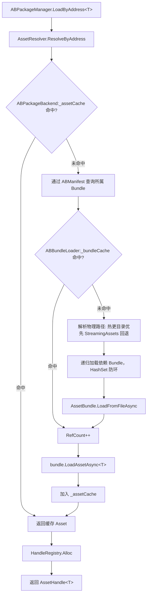
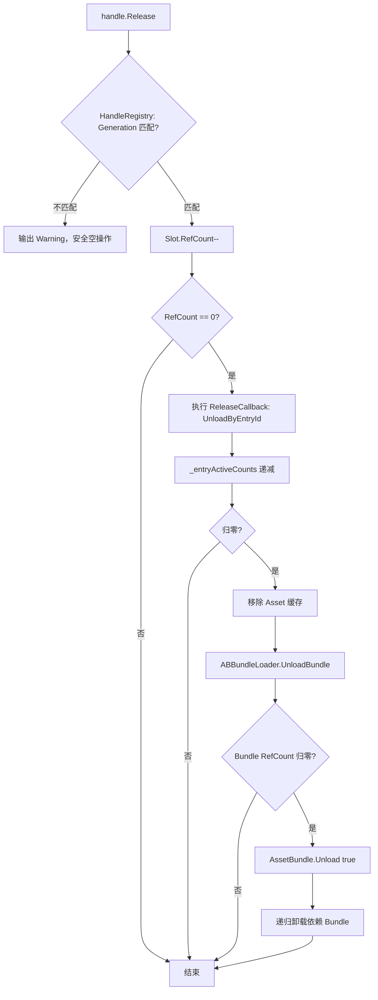

# AB 运行时加载

> 返回总览：[资源管理架构文档](./资源管理架构文档.md)

> **关联代码**
>
> `Assets/FYAsset/Scripts/AB/Runtime/ABPackageManager.cs` · `Assets/FYAsset/Scripts/Shared/Runtime/PackageManagerBase.cs` · `Assets/FYAsset/Scripts/Compat/AssetPackageManager.cs` · `Assets/FYAsset/Scripts/AB/Runtime/Backends/`

---

## 概述

AB 运行时加载系统负责从磁盘加载 AssetBundle 文件、从 Bundle 中提取 Unity 资源、管理引用计数和生命周期。整体架构为三层：**Bundle 层 → Asset 层 → Handle 层**，每层独立管理引用计数，协同完成精确的资源卸载。

核心组件：

| 组件 | 职责 |
|------|------|
| `ABManifestLoader` | 异步加载 ABManifest 清单文件 |
| `ABAssetIndex` | 基于 ABManifest 构建运行时索引，提供零分配查询 |
| `ABBundleLoader` | AssetBundle 文件加载/卸载，管理 Bundle 级引用计数和依赖递归 |
| `ABPackageBackend` | Asset 级加载/卸载，管理 Asset 缓存和 Handle 回调 |
| `AssetResolver` | 将 Address / TypeKey 解析为 RuntimeAssetEntry |
| `HandleRegistry` | 静态 Handle 注册表，管理外部持有的 AssetHandle 引用计数 |
| `ABPackageManager` | AB 上层 concrete 入口 |
| `AssetPackageManager` | 旧兼容入口，根据 Backend 设置路由到 AA/AB |

---

## 清单加载

`ABManifestLoader.LoadAsync()` 异步加载 `ABManifest`。

**路径策略**：
1. 热更目录优先（`RuntimePathManager.CurrentGUIDRoot`）
2. StreamingAssets 回退（包内初始资源）
   - 在线模式：`StreamingAssets/`
   - 离线模式（`FYAssetSettings.StandaloneBuild=true`）：`StreamingAssets/Standalone/`

`ABBundleLoader` 的 fallback 与上述策略一致：在线读 `StreamingAssets/bundles/`，离线读 `StreamingAssets/Standalone/bundles/`。两套包物理隔离，可同时存在、按开关切换。

**格式优先级**（每个目录内）：
1. `ABManifest.bin`（二进制，优先）
2. `ABManifest.json`（JSON，fallback）

返回 null 表示全部路径均加载失败。当前通过 `FileHelper.ReadAllBytesAsync` 读取；Android StreamingAssets 路径由 `FileHelper` 走 `UnityWebRequest`，其他平台走文件系统异步读取。Android 离线包暂不在当前支持范围。

---

## 资源索引

`ABAssetIndex` 实现 `IAssetIndex`，基于 `ABManifest` 预建运行时查询结果：

| 索引 | 类型 | 查询方法 |
|------|------|---------|
| Address → Entries | `Dictionary<string, RuntimeAssetEntry[]>` | `GetEntriesByAddress` |
| Address + PrimaryType → Entries | `Dictionary<(string,string), RuntimeAssetEntry[]>` | `GetEntriesByAddressAndType` |
| EntryId → Entry | `Dictionary<string, int>` | `GetEntryById` |
| 全部条目 | `RuntimeAssetEntry[]` | `GetAllEntries` |

初始化时遍历 `ABManifest.AssetEntries`，调用 `ToRuntimeEntry()` 转换为 `RuntimeAssetEntry` 数组并预缓存。所有查询方法返回缓存的 `RuntimeAssetEntry` 引用，热路径零分配。

---

## 双层引用计数架构

AB 路径采用 **Bundle + Asset** 双层引用计数，配合 Handle 层对外暴露，实现精确的卸载粒度控制。

| 层级 | 管理者 | 数据结构 | 职责 |
|------|--------|---------|------|
| **Handle 层** | HandleRegistry | `Slot[]` 数组 | 管理外部持有的 `AssetHandle<T>` 引用计数，归零时触发释放回调 |
| **Asset 层** | ABPackageBackend | `_assetCache: Dict<entryId, AssetCacheEntry>` | 管理从 Bundle 中提取的 Asset 引用计数，归零时联动 Bundle 卸载 |
| **Bundle 层** | ABBundleLoader | `_bundleCache: Dict<bundleName, BundleCacheEntry>` | 管理 AssetBundle 文件引用计数，归零时执行 `Unload(true)` |

### 引用计数语义

- **Bundle RefCount** = 该 Bundle 下所有已加载 Asset 的引用数之和。每次加载时 +1，释放时 -1
- **Asset 级多 Handle 计数** = `HandleRegistry._entryActiveCounts`，同一 EntryId 的多个 Handle 共享此计数。归零时触发 `ReleaseCallback`
- **Handle RefCount** = 外部显式持有的引用数（Load 时 = 1，Retain 时 +1）

---

## 加载流程



`_inflightLoads` 字典做并发去重：同一 EntryId 的并发加载请求共享同一个 Task。依赖关系从 `ABManifest.BundleEntries[].DependBundleIndices` 获取，加载依赖失败时回滚已加载的 Bundle。

## 卸载总览



---

## 卸载流程

### 1. 用户调用 Release

`handle.Release()` 先校验 Generation。过期 Handle 或拷贝体误释放只记录 Warning；有效 Handle 才减少槽位引用计数。

### 2. Handle 引用归零

Handle 引用归零后执行 ReleaseCallback；同一 EntryId 的活动计数也归零时，才移除 Asset 缓存并释放其 Bundle。随后槽位递增 Generation 并归还 FreeList。

### 3. Bundle 层卸载

Bundle 引用归零时调用 `AssetBundle.Unload(true)`，再递归释放依赖 Bundle；仍有引用则保持加载。

### 安全保护

- **Generation 校验**：过期 Handle 或拷贝体的 Release 被拦截为空操作
- **拷贝体不自动 Retain**：需要共享所有权必须显式调用 `handle.Retain()`
- **加载失败返回无效 Handle**（HandleId = -1），Release 为空操作

---

## 资源解析

`AssetResolver` 提供两个解析入口：

| 方法 | 查询依据 | 返回 |
|------|---------|------|
| `ResolveByAddress<T>` / `ResolveByAddressExact<T>` | Address + 可赋值/精确类型约束 | `ResolveResult` |
| `ResolveByTypeKey<T>` | Address Key + PrimaryType + 可选 Labels | `ResolveResult` |
| `ResolveRawByAddress` | Address + 可选 Labels + RawFile PayloadKind | `ResolveResult` |

`ResolveResult` 的公开状态为四种；`InvalidPayloadKind` 与 `IndexNotSupported` 通过现有状态配合结构化 `RuntimeMessage` 表达：

| 状态 | 含义 |
|------|------|
| `Hit` | 恰好一条匹配，`Entry` 非 null |
| `NotFound` | 未找到匹配 |
| `Conflict` | 多条匹配且无法消歧，`Candidates` 列出所有候选项 |
| `TypeMismatch` | 找到条目但 PrimaryType 与请求类型不兼容 |

---

## AssetHandle — 句柄模型

`AssetHandle<T>` 是值类型 struct，零 GC 分配。提供：

- `Asset` — 已加载的资源引用（Handle 无效时返回 null）
- `IsValid` — 是否有效（未释放/未过期/加载成功）
- `Error` — 结构化错误信息（`RuntimeMessage`）
- `Retain()` — 增加引用计数，返回自身（支持链式调用）
- `Release()` — 减少引用计数

内部字段：
- `HandleId` — HandleRegistry 槽位索引
- `Generation` — 版本号，防止悬空复用
- `_cachedAsset` — 缓存引用，热路径直接返回（避免查 Registry）
- `_inlineError` — 失败句柄的内联错误（HandleId = -1 时使用）

---

## ABPackageManager — 上层入口

`ABPackageManager` 是 AB concrete 入口，提供初始化、按 Address/TypeKey 加载和按 Label 卸载。旧 `AssetPackageManager` 仍作为兼容门面，根据启动宿主绑定的 `BackendMode` 路由到 AA 或 AB。

Resolve-And-Handle API 返回 `AssetHandle<T>`；兼容的 `LoadAssetAsync<T>` / `LoadAssetSync<T>` 仍直接返回资源对象。AB concrete 入口固定使用 `ABPackageBackend`。

---

## 完整调用链

```mermaid
sequenceDiagram
    participant User as 调用方
    participant APM as ABPackageManager
    participant Resolver as AssetResolver
    participant Backend as ABPackageBackend
    participant Loader as ABBundleLoader
    participant Unity as Unity AssetBundle API
    participant Registry as HandleRegistry

    User->>APM: LoadByAddress&lt;T&gt;(address)
    APM->>Resolver: ResolveByAddress&lt;T&gt;(index, address)
    Resolver-->>APM: RuntimeAssetEntry (entryId, bundleName)

    APM->>Backend: LoadAssetTupleAsync&lt;T&gt;(address, entryId)
    Backend->>Backend: 检查 _assetCache（未命中）
    Backend->>Loader: LoadBundleAsync(bundleName)

    Loader->>Loader: 检查 _bundleCache（未命中）
    Loader->>Loader: 递归加载依赖 Bundle
    Loader->>Unity: LoadFromFileAsync(path)
    Unity-->>Loader: AssetBundle
    Loader-->>Backend: AssetBundle

    Backend->>Unity: LoadAssetAsync&lt;T&gt;(sourcePath)
    Unity-->>Backend: T asset

    Backend-->>APM: (T asset, bundleName, null)

    APM->>Registry: Alloc(entryId, bundleName, releaseCallback)
    Registry-->>APM: (handleId, generation)
    APM-->>User: AssetHandle&lt;T&gt;(handleId, generation, asset)
```
