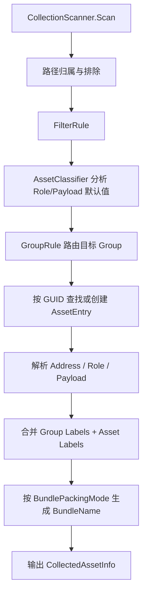

# Collector 采集与资产元数据

> 返回总览：[资源管理架构文档](./资源管理架构文档.md)

> **关联代码**
>
> `Assets/FYAsset/Scripts/Build/Collector/AssetCollectionSetting.cs` · `Assets/FYAsset/Scripts/Build/Collector/Editor/CollectionScanner.cs` · `Assets/FYAsset/Scripts/Build/Collector/Editor/BundleNameBuilder.cs`

---

## 概述

Collector 现在只负责编辑器时期的资产发现与分析，不再保存运行时 Address、业务 Labels 或打包规则。构建时真正生效的资产元数据来自 Group 默认配置和按 GUID 保存的 `AssetEntry`。

核心关系：

```text
AssetCollectionSetting
  ├─ Packages
  │   └─ Groups
  │       └─ Collectors
  └─ AssetEntries（按 AssetGUID 保存）
```

---

## 职责边界

| 对象 | 职责 |
|---|---|
| Package | 包/发布边界，语义不变 |
| Group | 类 Addressables 的配置域，保存 Group Labels 和 BundlePackingMode |
| Collector | 采集路径、过滤、分组路由、Role/Payload 分析默认值 |
| AssetEntry | 资产级权威元数据：Address、Labels、Role、PayloadKind |

Collector 不再保存 `AddressRuleName`、`PackRuleName` 或 Collector Labels。

---

## AssetEntry

`AssetEntry` 按 Unity GUID 保存：

- `AssetGUID`
- `AutoAddress`, `Address`
- `Labels`
- `AutoRole`, `Role`
- `AutoPayload`, `PayloadKind`

新扫描到的资产会用 Collector 分析结果初始化。已有 AssetEntry 不会被重新扫描静默覆盖；编辑器提供 Address、Role、Payload 三个独立的 Reset Auto 操作。

---

## Address 生成与覆写

Address 是运行期逻辑名，允许重复，不是资产唯一身份。资产唯一身份由 Unity GUID 映射到运行期 `EntryId`；运行期解析通过 `Address + PrimaryType + Labels` 逐步收敛，完全无法区分时才应阻断。

当前自动 Address 由 `AssetCollectionSetting.AddressStyle` 控制，AssetsCollection 的 Package 详情中可以调整项目级默认样式：

- 默认自动 Address = 文件短名（文件名去扩展）。
- 短名冲突不自动升级；同名 Address 本身允许存在。
- 长路径样式 = `Assets/...` 去扩展名，例如 `Assets/UI/Icon`。
- `Name#Type` 只作为显式统一选项，由用户在资产级或 Group 批量操作中应用。
- 手动覆写项保持锁定；Group 批量操作只修改 `AutoAddress=true` 的资产。

`#` 可以出现在 Address 中，但不能出现在 PackageName、GroupName、Labels 或 BundleKey 中。PackSeparately 会把 Address 投影成 BundleKey，因此 `Player#Prefab` 这类 Address 最终不会让 BundleName 带上 `#`。

---

## Labels

最终 Labels 计算规则：

```text
FinalLabels = Group.Labels + AssetEntry.Labels
```

Group Labels 是强制继承标签，资产级不能删除或覆盖。AssetEntry Labels 只做手动追加。

---

## BundlePackingMode

Group 使用 `BundlePackingMode` 控制打包：

| 模式 | BundleName |
|---|---|
| `PackTogether` | `{package}_{group}_all` |
| `PackSeparately` | `{package}_{group}_asset_{normalizedAddress}~{shortGuid8}` |
| `PackTogetherByLabel` | `{package}_{group}_labels_{labelA}~{labelB}` |
| 无 Labels | `{package}_{group}_labels_$unlabeled` |

Scene 资产强制按 `PackSeparately` 处理，只影响打包粒度，其余命名规则一致。

`BundleKey` 只是构建期中间分桶键，不是业务 Label，也不是运行时查询字段。

---

## 扫描流程



Collector 仍保留 RawFile/Scene/Serialized 的分析能力。`ForcePayloadKind.Auto` 会把 `.unity` 识别为 Scene，已知 Unity 资产扩展识别为 Serialized，其余文件识别为 RawFile。

---

## 系统保留标识

`$` 是系统保留前缀。用户配置的 Package、Group、Labels 不能包含 `$` 和其他 BundleName 保留字符。框架内部可生成 `$shared`、`$unlabeled` 等系统值。
