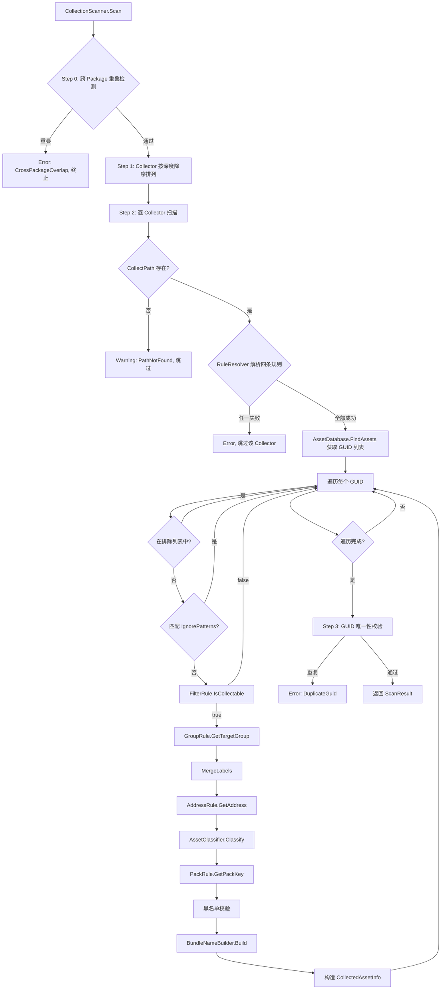

# Collector 规则系统

> 返回总览：[资源管理架构文档](./资源管理架构文档.md)

> **关联代码**
>
> `Assets/FYAsset/Scripts/Build/Collector/Editor/Rules/` · `Assets/FYAsset/Scripts/Build/Collector/Editor/CollectionScanner.cs` · `Assets/FYAsset/Scripts/Build/Collector/Editor/BundleNameBuilder.cs` · `Assets/FYAsset/Scripts/Build/Collector/CollectorSetting.cs`

---

## 概述

Collector 规则系统负责将 Unity 项目中的资产文件组织成可供构建管线处理的 `CollectedAssetInfo` 列表。用户通过 ScriptableObject 配置层级化的采集规则，系统按规则扫描项目目录，为每个符合条件的资产计算其 Group 归属、Bundle 名称、运行时 Address 等信息。

---

## 配置层级

配置结构为四层树：**Setting → Package → Group → Collector**。

```
CollectorSetting (.asset)
  └─ Package[0] (如 "MainPackage")
       ├─ SharePolicy (per-package 共享提取策略)
       └─ Group[0] (如 "Characters")
            ├─ GroupName, Labels
            └─ Collector[0]
                 ├─ CollectPath (如 "Assets/Art/Characters/")
                 ├─ CollectorType (Main / Static / Depend)
                 ├─ ForcePayloadKind (Auto / Serialized / RawFile / Scene)
                 ├─ FilterRuleName ← 绑定规则类名
                 ├─ GroupRuleName
                 ├─ PackRuleName
                 ├─ AddressRuleName
                 └─ Labels
```

关键约束：
- `$` 前缀由系统保留，用户定义的 PackageName / GroupName / Labels 不得以 `$` 开头
- Group 的 `Labels` 与 Collector 的 `Labels` 取并集，合并后写入最终资产的 Labels 列表
- `Enabled = false` 的 Group 会被 CollectionScanner 整体跳过

---

## 资产分类

每个资产在扫描时通过 `AssetClassifier` 获得一个 `AssetClassification` 结果，包含两个正交维度：

### 语义角色（EAssetRole）

| 值 | 来源 | 含义 |
|----|------|------|
| `Main` | CollectorType = Main | 可寻址入口资产，运行时通过 Address 加载 |
| `Static` | CollectorType = Static | 内部打包资产，不对外暴露 Address |
| `Depend` | CollectorType = Depend | 显式声明的依赖资产 |
| `ImplicitDependency` | 依赖分析自动发现 | 被多处引用的隐式依赖 |

### 载荷类型（EPayloadKind）

| 值 | 判定条件 | 构建处理 |
|----|---------|---------|
| `Serialized` | 默认（非场景、非 RawFile 强制） | 打入 AssetBundle |
| `RawFile` | ForcePayloadKind = RawFile | 直接拷贝原始文件 |
| `Scene` | 扩展名为 .unity，或 ForcePayloadKind = Scene | 独立打包为 Scene Bundle |

`ForcePayloadKind` 为 `Auto` 时由 Classifier 自动推断，非 `Auto` 时覆盖自动结果。

---

## 四规则管线

Collector 系统的核心是四个规则接口。CollectionScanner 在扫描每个资产时按固定顺序调用它们：

```
FilterRule → GroupRule → AddressRule → PackRule
   ↓            ↓            ↓            ↓
 是否采集    归属哪个    运行时地址    Bundle 键
             Group
```

### 执行顺序的设计原因

1. **FilterRule 先执行**：如果资产不需要采集，后续计算都无意义
2. **GroupRule 第二**：后续 PackRule 需要知道 GroupName 来计算 Bundle 名
3. **AddressRule 第三**：Address 生成只依赖资产自身属性，与 PackRule 独立
4. **PackRule 最后**：需要消费 GroupName + Labels（已经过 MergeLabels 处理）

每条规则都有对应的 Context 结构体，提供该步骤所需的全部信息：

| 规则 | Context 类型 | 关键字段 |
|------|-------------|---------|
| IFilterRule | `FilterRuleContext` | AssetPath, Extension, CollectPath |
| IGroupRule | `GroupRuleContext` | AssetPath, Classification, CollectPath, PackageName, ParentGroupName |
| IAddressRule | `AddressRuleContext` | AssetPath, GroupName, CollectPath, PrimaryType |
| IPackRule | `PackRuleContext` | AssetPath, GroupName, CollectPath, PackageName, Classification, Labels |

---

## 规则接口详解

### IFilterRule — 过滤规则

决定资产是否被采集。返回 `true` 采集，`false` 跳过。

```csharp
public interface IFilterRule
{
    bool IsCollectable(FilterRuleContext ctx);
}
```

默认实现 `CollectAll`：排除 `.meta`、`.cs`、`.dll`、`.asmdef`、`.asmref`、`.gitignore` 文件，排除路径中包含 `Editor` 目录的资源。

### IGroupRule — 分组规则

决定资产归属到哪个 Group。一个 Collector 可以通过 GroupRule 将不同资产路由到不同 Group（例如按子目录、按类型分配）。

```csharp
public interface IGroupRule
{
    string GetTargetGroup(GroupRuleContext ctx);
}
```

默认实现 `GroupAll`：始终返回 Collector 所在的父 Group 名称，即不改变归属。

`GroupRuleContext.ParentGroupName` 提供 Collector 在配置树中所在 Group 的名称，供回退规则使用。

### IPackRule — 打包规则

为资产生成 PackKey，框架用此 Key 结合 PackageName 和 GroupName 组装最终的 Bundle 逻辑名。

```csharp
public interface IPackRule
{
    string GetPackKey(PackRuleContext ctx);
}
```

内置四种实现：

| 实现 | PackKey 策略 | 适用场景 |
|------|-------------|---------|
| `PackSeparately` | 文件名（不含扩展名） | 每个资源独立打包 |
| `PackByDirectory` | CollectPath 下的第一级子目录名 | 按子目录分组打包 |
| `PackByLabel` | Labels 排序后以 `--` 连接 | 按标签分组打包 |
| `PackByCollectPath` | CollectPath 末段目录名 | 整个 Collector 目录统一打包 |

`PackByLabel` 无 Labels 时返回哨兵值 `$orphan`，由 `SystemIdentifiers.OrphanPackKey` 定义。

`PackByDirectory` 处理根级资源时回退到 `PackByCollectPath`。

### IAddressRule — 地址规则

为资产生成运行时的 Address 字符串，供 `AssetPackageManager.LoadByAddress<T>()` 查询使用。

```csharp
public interface IAddressRule
{
    string GetAddress(AddressRuleContext ctx);
}
```

默认实现 `AddressByFileName`：委托给 `AssetAddressGenerator.GenerateShortAddress(assetPath, primaryType)`，生成不含扩展名的短地址。

---

## CollectionScanner 扫描管线

`CollectionScanner.Scan(CollectorSetting)` 是扫描入口，返回 `ScanResult`（包含 `List<CollectedAssetInfo>` 和 `List<BuildMessage>`）。

### 扫描流程



### 各步骤说明

**Step 0：跨 Package 重叠检测** — 检查不同 Package 的 Collector 是否有相同或包含关系的 CollectPath。路径相同或一个包含另一个则报错终止。

**Step 1：所有权映射** — 将 Collector 按 CollectPath 深度降序排列。更深路径的 Collector 对重叠区域拥有所有权，浅路径 Collector 扫描时排除已被声明的子目录，确保一个资产只被一个 Collector 采集。

**Step 2：逐 Collector 扫描** — 校验路径 → 解析规则 → 遍历 GUID → 调用四条规则 → MergeLabels → 黑名单校验 → 组装 Bundle 名称。

**Step 3：GUID 唯一性校验** — 同一 Package 内出现重复 Asset GUID 则报错。

### GlobMatcher 通配符

CollectPath 支持 `*` 通配符匹配。`GlobMatcher` 使用分段匹配算法：将模式按 `*` 分割后逐段按序匹配。

---

## BundleNameBuilder 命名规范

`BundleNameBuilder.Build(packageName, groupName, packKey)` 组装标准化三段式名称：

```
{packageName}_{groupName}_{packKey}
```

各段经 `SanitizeSegment` 处理：
- 转为小写
- 空字符串替换为 `"default"`

### 黑名单校验

段值（PackageName / GroupName / Labels）在进入 `Build` 前必须通过黑名单校验。黑名单字符共 16 个：

```
/  \  :  *  ?  <  >  "  |  .  (空格)  ;  %  ~  $  _
```

PackKey 的黑名单少一个 `~`（15 个），因为 `PackByLabel` 有意使用 `~` 作为标签连接符。

段值包含黑名单字符 → `BuildMessage.Error`，阻断构建。不静默替换。

### 可逆性

顶层分隔符 `_` 不在段值中出现（已被黑名单拦截），因此按 `_` 分割始终得到恰好三段。PackKey 内部若来自 `PackByLabel`，可进一步按 `~` 分割还原标签列表。

最终输出的 Bundle 名称不含 Hash 和 `.bundle` 扩展名——这些由后续的 `TaskBuildBundles` 追加。

---

## SystemIdentifiers 系统保留标识符

`SystemIdentifiers` 类统一管理所有系统生成的保留名称，以 `$` 为前缀防止与用户命名冲突。

| 常量 | 值 | 用途 |
|------|-----|------|
| `Prefix` | `$` | 系统保留前缀 |
| `OrphanPackKey` | `$orphan` | PackByLabel 无 Labels 时的哨兵值 |
| `SharedGroupName` | `$shared` | 依赖分析中共享 Bundle 的保留 Group 名 |
| `DefaultPackKey` | `default` | PackRule / BundleNameBuilder 的回退值 |
| `SegmentSeparator` | `_` | Bundle 名顶层段分隔符 |
| `LabelSeparator` | `~` | PackByLabel 标签连接符 |
| `ReservedChars` | 16 个字符 | PackageName / GroupName / Labels 黑名单 |
| `PackKeyReservedChars` | 15 个字符 | PackKey 黑名单（不含 `~`） |

`IsSystemReserved(value)` 方法检查给定值是否以 `$` 开头。

---

## 编写自定义规则

所有规则实例通过 `RuleResolver` 反射创建并缓存，要求：
- 实现对应的规则接口
- 提供无参构造函数

示例：自定义一个按资产类型打包的 PackRule：

```csharp
public sealed class PackByType : IPackRule
{
    public string GetPackKey(PackRuleContext ctx)
    {
        return ctx.Classification.PayloadKind switch
        {
            EPayloadKind.Scene => "scenes",
            EPayloadKind.RawFile => "raw",
            _ => ctx.Classification.Role.ToString().ToLower()
        };
    }
}
```

使用方式：在 Collector 的 `PackRuleName` 字段填入 `"PackByType"`。`RuleResolver` 会通过程序集反射找到该类。

---

## 辅助模块

### RuleResolver

规则解析器，负责将规则类名字符串解析为实例。内部维护四个缓存字典（每种规则类型一个），对已解析的规则类名直接返回缓存实例，避免重复反射。

### AssetAddressGenerator

提供 `GenerateShortAddress(assetPath, primaryType)` 方法，生成不含扩展名的短地址。默认处理逻辑为取文件名（不含扩展名）。

### CollectorSettingValidator

保存时校验器，检查 9 条规则：空 PackageName、重复 PackageName、空 GroupName、重复 GroupName、空 CollectPath、路径不存在、跨 Package 重叠、同路径冲突、规则类名无法解析。
