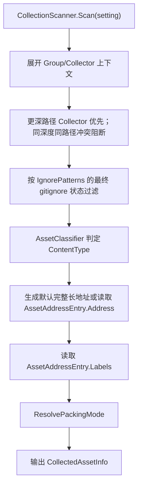

# Collector 采集与配置

> 返回总览：[资源管理架构文档](./资源管理架构文档.md)

> **关联代码**
>
> `Assets/FYAsset/Scripts/AB/Build/Collector/AssetCollectionSetting.cs` · `CollectorEnums.cs` · `RawFileRules.cs` · `GitIgnoreMatcher.cs` · `SharePolicyConfig.cs` · `Editor/CollectionScanner.cs` · `Editor/AssetClassifier.cs` · `Editor/AssetCollectionSettingValidator.cs` · `Editor/BundleNameBuilder.cs` · `Editor/CollectorMutationUtility.cs` · `Editor/AssetAddressGenerator.cs`

---

## 概述

采集配置只有三层：`AssetCollectionSetting → AssetCollectionGroup → Collector`。显式 Collector 收集到的资源都是公共资源；依赖分析自动发现的资源由构建阶段内部化，配置层不保存 Package、Role 或载荷类型声明。

```text
AssetCollectionSetting
  ├─ Groups[]                 Group：打包方式 + Collectors
  │    └─ Collectors[]        CollectPath + CollectPathType(Folder|File)
  ├─ AssetAddressEntries[]    AssetGUID → Address / Labels（仅保存用户明确编辑的数据）
  ├─ IgnorePatterns[]         扫描与构建的 gitignore 规则
  ├─ RawFileRules.Patterns[]  按同一 gitignore 语义决定 RawFile 分类
  └─ SharePolicy              ForceSharePatterns / NoSharePatterns
```

采集配置是编辑器/构建期资产：不保存运行时 Address 索引、不保存反射规则名。

## 职责边界

| 对象 | 职责 |
|---|---|
| `AssetCollectionSetting` | 项目级采集根：Group、Address/Labels 资源信息、忽略、RawFile 和共享策略 |
| `AssetCollectionGroup` | `GroupName`、`Enabled`、`BundlePackingMode`、`Collectors`；只控制显式资源打包 |
| `Collector` | 一个目录或单个文件：`CollectPath` + `CollectPathType` |
| `AssetAddressEntry` | 按 Unity GUID 保存用户明确编辑的 `Address` 与 `Labels`；Address 为空时使用完整长路径 |
| `RawFileRules` | 单一 `Patterns` 列表；命中后按 RawFile 构建和加载 |
| `SharePolicyConfig` | 依赖共享策略，由 `DependencyAnalyzer` 在构建期执行 |

`CollectedAssetInfo` 是扫描产出的中间记录（不序列化）：`AssetPath`、`AssetGUID`、`Address`、`AssetType`、`Labels`、`GroupName`、`SourceGroupName`、`SourceCollectorPath`、`ContentName`、`BundlePackingMode`、`ContentType`、`DependencyOrigin`、`IsPublic`。`ScanResult.SystemSources` 另固定记录唯一只读的 `Assets/Resources` 系统来源；它不生成 `CollectedAssetInfo`，不进入 snapshot、Content、Manifest、Summary 或交付。

## 分类与内容类型

`AssetClassifier.ClassifyContentType(assetPath, rawFileRules)` 按固定顺序判定：

```text
RawFile Patterns 的最终匹配结果
→ Scene（.unity）
→ Unity 可有效识别并作为 SerializedObject 构建
→ 其余一律 RawFile
```

Shader include、脚本、程序集定义、元文件和 Editor 目录由扫描阶段的默认排除规则处理。Scene 与 RawFile 强制 `PackSeparately`。RawFile 只做物理文件拷贝，不进入 BundleLoader，也不参与 Bundle 卸载。

## gitignore 规则

`IgnorePatterns` 与 `RawFileRules.Patterns` 共用 `GitIgnoreMatcher`。规则按列表顺序处理，最后一个匹配规则决定结果：普通规则启用匹配，`!` 规则取消前面的匹配。

支持的基础语义：

- `*` 匹配单个路径段内的任意字符，`?` 匹配单个字符。
- `**` 匹配跨目录路径；末尾 `/` 匹配目录及其内容。
- 包含 `/` 的规则按项目路径匹配；不含 `/` 的规则按任意路径段匹配。
- `Assets/...` 或 `/...` 可用于限定项目路径；`#` 开头为注释。
- 规则不区分大小写，路径统一使用 `/`。

上层含义不同：Ignore 的最终匹配结果为 true 时跳过资产；RawFile 的最终匹配结果为 true 时把资产按原始文件处理。两者都可用 `!` 恢复单个路径或子目录。

## Address

Address 是运行期逻辑查询键。公共 Address 在单包内大小写不敏感且唯一，冲突由构建校验阻断。

Address 默认生成完整 `Assets/.../file.ext` 路径，保留扩展名。Details 中可直接编辑 Address；左侧 Asset 行右键可选择：

- `ShortName`：文件名去扩展名。
- `LongAssetPath`：完整 `Assets/.../file.ext` 路径。

左侧 Group 行右键使用同样的两个选项，并覆盖该 Group 当前扫描到的全部资产。左侧 Asset 行右键只作用于该 Asset；选中的 Group/Asset 支持批量地址样式操作。Address/Labels 只在 Details 编辑，独立的 AssetAddressEntries 页面已删除。

## Labels

最终 Labels 只来自 `AssetAddressEntry.Labels`，Group 不提供 Labels。Labels 可缺省；存在时必须非空、无首尾空白、大小写不敏感唯一，且保留第一次填写的拼写用于序列化。

未收集资产不会因为修改 Labels 自动创建采集器；Collection 面板中的修改写入工作副本，只有 Save 才持久化，Cancel 丢弃工作副本。Label 不得包含 `BundleNameBuilder.ValidateSegment` 禁止的保留字符。

## 扫描流程



忽略规则同时作用于 Project Scan 与构建扫描；`GetEffectiveIgnorePatterns()` 会补上框架级默认项。场景文件始终通过明确的 File Collector 参与收集，扫描器跳过 Folder Collector 下的 `.unity`。

## 编辑器增删

Inspector、Project 右键菜单、选择器窗口和 Collection 面板的资产增删统一走 `CollectorMutationUtility`：

- `AddToGroup`：在目标 Group 下创建 File 或 Folder Collector；若资产被精确 Ignore 规则命中，则先移除该规则。
- `RemoveOrIgnore`：删除直接 File Collector；被 Folder Collector 覆盖的文件则把精确路径追加到 `IgnorePatterns`。
- `RestoreIgnored`：移除精确路径规则，恢复采集。
- `Changed` 事件：变更后通知 Collection 面板重建工作副本的扫描状态。

Collection 面板使用一个可编辑工作副本：左侧编辑 Group、Collector 和 Asset，右侧顶部用三个互斥按钮切换 Details、Scan、Settings。Scan 提供 `Refresh` 与 `Apply`；`Apply` 用扫描结果替换全部 Group/Collector，同时保留全局规则和仍存在 GUID 的 Address/Labels。Settings 编辑 Ignore、RawFileRules、SharePolicy。Save 前仍执行结构化校验，错误会阻止写盘；Cancel 丢弃工作副本。手动 Validate 按钮已删除。

## Collection 视图

Collection 左侧树显示资源当前 Address，支持普通点击、`Ctrl/Cmd` 切换选择和 `Shift` 连续选择；点击 Group 只选中并高亮 Group 本身，不展开高亮其资产；右侧顶部用 Details、Scan、Settings 三个互斥按钮切换视图。Details 的 Asset Path、Content、Group、GUID、Address、Labels 使用统一字号。`Content` 是扫描计算出的逻辑内容名，用于查看资产最终归属的 Bundle/Content。Group、Collector、Bundle 预览初始全部折叠；当前面板生命周期内保留手动展开状态，重新进入 Collection 时重置。

## 配置校验

`AssetCollectionSettingValidator.Validate(setting)` 在构建与 Save 前共用，产出结构化 `BuildMessage`：

| 检查 | 错误码 |
|---|---|
| Setting 为空 / 无 Group | `SETTING_NULL` / `NO_GROUPS` |
| Group 名为空 / 含保留字符 / 重名 | `EMPTY_GROUP_NAME` / `INVALID_BUNDLE_NAME_SEGMENT` / `DUPLICATE_GROUP_NAME` |
| CollectPath 为空 / 路径不存在 | `EMPTY_COLLECT_PATH` / `PATH_NOT_FOUND` |
| 同深度同路径冲突 | `SAME_PATH_CONFLICT` |
| AssetAddressEntry GUID 无效 / 重复 | `INVALID_ASSET_ADDRESS_ENTRY_GUID` / `DUPLICATE_GUID` |
| Ignore、RawFile 或 SharePolicy 列表空项 | `BLANK_CONFIG_ENTRY` |
| Label 空项、首尾空白、大小写不敏感重复或含保留字符 | `BLANK_CONFIG_ENTRY` / `DUPLICATE_LABEL` / `INVALID_LABEL` |

构建期还会独立校验公共 Address 唯一、Public 边界、成员关系与文件集合。

## 系统保留标识

`$` 是系统保留前缀。用户配置的 Group、Labels 不能包含 `$` 和其他保留字符；框架内部使用 `$shared` 与 `$unlabeled`。
