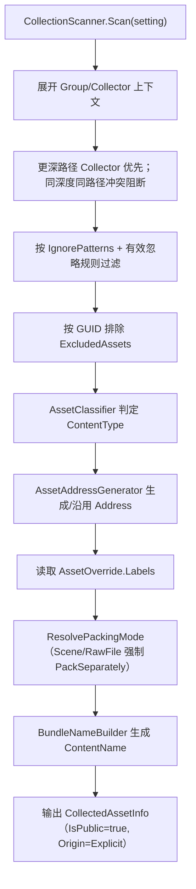

# Collector 采集与配置

> 返回总览：[资源管理架构文档](./资源管理架构文档.md)

> **关联代码**
>
> `Assets/FYAsset/Scripts/AB/Build/Collector/AssetCollectionSetting.cs` · `CollectorEnums.cs` · `RawFileRules.cs` · `SharePolicyConfig.cs` · `Editor/CollectionScanner.cs` · `Editor/AssetClassifier.cs` · `Editor/AssetCollectionSettingValidator.cs` · `Editor/BundleNameBuilder.cs` · `Editor/CollectorMutationUtility.cs` · `Editor/AssetAddressGenerator.cs`（`AB/Build/`）

---

## 概述

采集配置只有三层：`AssetCollectionSetting → AssetCollectionGroup → Collector`。显式 Collector 收集到的资源都是**公共资源**；依赖分析自动发现的资源由构建阶段内部化，因此配置层不需要 Package、Role 或载荷类型的用户声明。

```text
AssetCollectionSetting
  ├─ AddressStyle        项目级自动 Address 样式
  ├─ Groups[]            Group：打包方式 + Collectors
  │    └─ Collectors[]   CollectPath + CollectPathType(Folder|File)
  ├─ AssetOverrides[]    AssetGUID → Address / Labels 人工覆盖
  ├─ IgnorePatterns[]    扫描与构建的忽略匹配
  ├─ ExcludedAssets[]    AssetGUID + 路径缓存（被 Folder Collector 覆盖但显式排除）
  ├─ RawFileRules        后缀 / 文件名 / 文件夹白名单
  └─ SharePolicy         ForceSharePatterns / NoSharePatterns
```

采集配置是纯编辑器/构建期资产：不保存运行时 Address 索引、不保存 Role/Payload、不保存反射规则名。

---

## 职责边界

| 对象 | 职责 |
|---|---|
| `AssetCollectionSetting` | 项目级采集根：Address 样式、Group 列表、人工覆盖、忽略、排除、RawFile 白名单、共享策略 |
| `AssetCollectionGroup` | 采集域：`GroupName`、`Enabled`、`BundlePackingMode`、`Collectors`；只控制显式资源的打包方式 |
| `Collector` | 一个目录或单个文件：`CollectPath` + `CollectPathType` |
| `AssetOverride` | 按 Unity GUID 的资产级人工覆盖：`Address`（空表示沿用自动生成）与 `Labels` |
| `AssetExclusion` | 按 GUID 的排除记录；`AssetPath` 只是编辑器展示与审计缓存 |
| `RawFileRules` | 项目级 RawFile 白名单，优先级高于 Unity 能否识别 |
| `SharePolicyConfig` | 依赖共享策略，决策在构建期由 `DependencyAnalyzer` 执行 |

`CollectedAssetInfo` 是扫描产出的中间记录（仅 Editor，不序列化）：`AssetPath`、`AssetGUID`、`Address`、`PrimaryType`、`Labels`、`GroupName`、`SourceGroupName`、`SourceCollectorPath`、`ContentName`、`BundlePackingMode`、`ContentType`、`DependencyOrigin`、`IsPublic`。它经依赖分析、内容构建后转换为 `ManifestAssetEntry` + `ManifestContentEntry`。

---

## 分类与内容类型

`AssetClassifier.ClassifyContentType(assetPath, rawFileRules)` 按固定顺序判定：

```text
RawFile 白名单
→ Scene（.unity）
→ Unity 可有效识别并作为 SerializedObject 构建
→ 其余一律 RawFile
```

- 判断标准是 Unity 能否有效识别并进入 SerializedObject 构建路线（`AssetDatabase.GetMainAssetTypeAtPath` + `LoadMainAssetAtPath` 得到可用的非 `DefaultAsset` 主资产），不把 Importer 当领域规则。
- Shader include（`.cginc` / `.hlsl` / `.hlslinc`，或导入为 `ShaderInclude`）不可作为 Bundle 入口，必须走 RawFile。
- Scene 与 RawFile 在扫描时强制 `PackSeparately`。
- RawFile 是普通物理文件：不伪装成 Bundle，不进入 BundleLoader，也不参与 Bundle 卸载。

内容类型枚举：

| `AssetContentType` | 构建与加载路线 |
|---|---|
| `SerializedObject` | 进入 Unity AssetBundle 构建，运行时通过 `AssetBundle.LoadAsset` |
| `Scene` | 独立 Scene Bundle，运行时通过 `SceneManager.LoadSceneAsync` 加载 |
| `RawFile` | 只做物理文件拷贝，运行时直接读取内容文件 |

`AssetDependencyOrigin`（`Explicit` / `Implicit`）只服务构建诊断，不进入运行时 Manifest。

---

## RawFile 白名单

`RawFileRules` 三个维度分别匹配，任一命中即按 RawFile 构建与加载：

| 维度 | 匹配方式 |
|---|---|
| `Extensions` | 路径后缀；项可带或不带前导点（`.json` 与 `json` 等价） |
| `FileNames` | 完整文件名精确匹配（`server.txt`） |
| `Folders` | 项目相对文件夹路径前缀匹配，目录内深层文件同样命中 |

匹配对大小写不敏感；不接受通配符。空项由 `AssetCollectionSettingValidator` 拒绝。命中白名单的 Unity 可识别文件也按 RawFile 构建和加载。

---

## Address

Address 是运行期逻辑查询键。公共 Address 在单包内**大小写不敏感且唯一**；冲突由构建校验阻断（`ADDRESS_UNIQUENESS`），运行期 `ABAssetIndex` 发现重复即拒绝整份索引。

自动 Address 由 `AssetCollectionSetting.AddressStyle` 决定：

| `AssetAddressStyle` | 结果 |
|---|---|
| `ShortName` | 文件短名（文件名去扩展）；只是枚举默认值（`= 0`），不代表本项目在用 |
| `LongAssetPathWithoutExtension` | `Assets/...` 路径，保留文件扩展名；**本项目** `Assets/FYAsset/CollectorData/CollectorSetting.asset` 显式设为该值（`AddressStyle: 1`） |
| `NameType` | `{短名}#{主类型}` |

枚举默认值（源码字段初始化）不等于本项目策略：实际生效值以项目配置资产为准，上表已标注两者差异。

`AssetOverride.Address` 非空时优先于自动生成，属于人工锁定项。`#` 可以出现在 Address 中，但不能出现在 GroupName、Labels 或 BundleKey 中；`BundleNameBuilder` 把 Address 投影成 BundleKey 时会规范化非法字符。

非加载查询只返回 Address：`GetAddressesByType<T>`、`GetAddressesByLabel`、`GetAddressesByTypeAndLabel<T>`。

---

## Labels

最终 Labels 只来自 `AssetOverride.Labels`（人工覆盖），Group 不再提供 Group Labels。Labels 属于资产级查询元数据。

- 未收集资产不会因为修改 Labels 自动创建覆盖条目。
- AB 的单项与批量 Labels 修改都写入 Curate 候选配置，只有 Save 才持久化；Cancel 丢弃未保存候选。
- Label 段不得包含保留字符（`BundleNameBuilder.ValidateSegment`）。
- AA 不使用 AB Collection；其 Labels 在 Addressables 原生编辑器维护。

---

## BundlePackingMode 与内容逻辑名

Group 的 `BundlePackingMode` 控制打包粒度。下表描述打包粒度，不是最终文件名的完整模板；`BundleNameBuilder` 还会按内容类型和精确主类型分桶，最终物理文件名由 `BundleNameBuilder.BuildPhysicalName` 决定（`{group}_{kind}[_{readable}]_{hash12}`），构建配置里不再有文件名风格选项。

| 模式 | 打包粒度 | BundleKey |
|---|---|---|
| `PackTogether` | Group 内合并 | `all` |
| `PackSeparately` | 每资产独立 | 规范化 Address + `~` + 短 GUID |
| `PackTogetherByLabel` | 按最终 Labels 分组 | 排序后的小写 Labels，用 `~` 连接；无 Labels 时 `$unlabeled` |

显式内容逻辑名结构：`{group}_{contentType}_{primaryType}_{mode}_{bundleKey}`；隐式共享内容使用 `$shared_{contentType}_{primaryType}_{bundleKey}`。`BundleKey` 只是构建期中间分桶键，不是业务 Label，也不是运行时查询字段。

Scene 与 RawFile 强制 `PackSeparately`；具体 BundleName 应查看扫描预览与 `BundleNameBuilder`，不要自行拼接。

---

## 扫描流程



规则要点：

- 一个资产归属其命中 Collector 所在的 Group；`SourceGroupName` / `SourceCollectorPath` 供编辑器预览树回溯来源。
- 更深路径的 Collector 优先；浅路径 Collector 会排除被更深 Collector 拥有的路径。
- 同深度同路径的多个 Collector 属于配置冲突，扫描直接返回错误。
- 忽略规则同时作用于 Project Scan 与构建扫描；`GetEffectiveIgnorePatterns()` 会补上框架级默认项（`Assets/AddressableAssetsData/**`、`*.cginc`、`*.hlsl`、`*.hlslinc`、`*.pdf`）。
- 场景文件始终以明确的 File Collector 参与收集，扫描器跳过 Folder Collector 下的 `.unity`。

Editor PlayMode 下 `EditorVirtualManifestBuilder` 用同一套扫描在内存里生成 `ABManifest`，供 `ABPackageManager` 通过 AssetDatabase 加载，不跑完整构建管线、不写磁盘。

---

## 编辑器增删与排除语义

Inspector、Project 右键菜单、选择器窗口和 AssetsCollection Curate 里的资产增删统一走 `CollectorMutationUtility`：

- `AddToGroup`：在目标 Group 下创建 File 或 Folder Collector。
- `RemoveOrExclude`：删除直接 File Collector；被 Folder Collector 覆盖的文件改为写入 `ExcludedAssets`。
- `RestoreExcluded`：移除排除记录，恢复采集。
- `Changed` 事件：任何变更都会通知已打开的 Collection 面板重建 Curate 扫描状态。

Collection 面板（`AssetsCollectionPanel`）的可见工作时序是 `Scan → Confirm To Curate → Curate/Save|Validate|Cancel`：Project Scan 只读，确认后才把快照复制为 Curate 候选；Save 持久化候选，Validate 只报告 `BuildMessage`，Cancel 丢弃候选。

---

## 配置校验

`AssetCollectionSettingValidator.Validate(setting)` 在构建与面板校验中共用，产出结构化 `BuildMessage`：

| 检查 | 错误码 |
|---|---|
| Setting 为空 / 无 Group | `SETTING_NULL` / `NO_GROUPS` |
| Group 名为空 / 含保留字符 / 重名 | `EMPTY_GROUP_NAME` / `INVALID_BUNDLE_NAME_SEGMENT` / `DUPLICATE_GROUP_NAME` |
| CollectPath 为空 / 路径不存在 | `EMPTY_COLLECT_PATH` / `PATH_NOT_FOUND` |
| 同深度同路径冲突 | `SAME_PATH_CONFLICT` |
| AssetOverride GUID 无效 / 重复 | `INVALID_ASSET_OVERRIDE_GUID` / `DUPLICATE_GUID` |
| RawFile / SharePolicy 列表空项 | `BLANK_CONFIG_ENTRY` |
| Label 空项或含保留字符 | `BLANK_CONFIG_ENTRY` / `INVALID_LABEL` |

构建期还会独立校验公共 Address 唯一、Public 边界、成员关系与文件集合（见 [Build Pipeline](./build-pipeline-构建管线.md)）。

---

## 系统保留标识

`$` 是系统保留前缀（`SystemIdentifiers.Prefix`）。用户配置的 Group、Labels 不能包含 `$` 和其他保留字符；框架内部使用 `$shared`（隐式共享内容 Group）与 `$unlabeled`（无 Label 的 BundleKey）。Bundle 名顶层段分隔符是 `_`，BundleKey 内部连接符是 `~`。

---

## 已删除的配置层与规则体系

| 已删除 | 现状 |
|---|---|
| `AssetCollectionPackage` 配置层 | Setting 直接持有 `Groups`；不保留 Package 兼容壳，未来多包必须另行设计 |
| `Group.Labels` | Labels 只来自 `AssetOverride` |
| `ECollectorType` / `EAssetRole` / `EForcePayloadKind` 及逐资产 Role/Payload 覆盖 | 改为推导出的 `IsPublic` / `AssetDependencyOrigin` / `AssetContentType`；Origin 不进入运行时 Manifest |
| `AssetEntries` 自动表 | 改为 `AssetOverrides`（只保存人工覆盖） |
| `IFilterRule` / `IGroupRule` / `RuleResolver` / `CollectAll` / `GroupAll` / `RuleDropdownHelper` 与序列化 `RuleName` | 反射规则体系整体删除，保留可验证的固定扫描行为 |
| `MinReferenceCount` / `MinAssetSizeBytes` | 共享判定只看引用方数量与 Force/NoShare 规则 |
