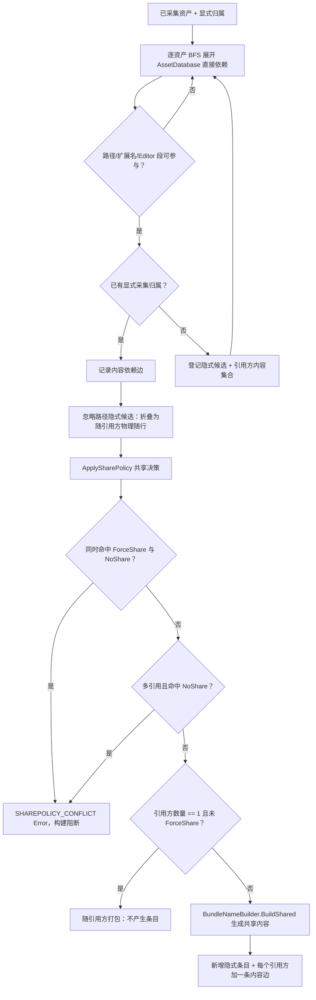

# 依赖分析与共享内容

> **关联代码** | [DependencyAnalysis](../../Assets/FYAsset/Scripts/AB/Build/Collector/Editor/DependencyAnalysis/) · [SharePolicyConfig](../../Assets/FYAsset/Scripts/AB/Build/Collector/SharePolicyConfig.cs) · [ABManifest](../../Assets/FYAsset/Scripts/AB/Runtime/Manifests/ABManifest.cs)

依赖分析在显式采集之后、内容构建之前执行。它发现 Asset 级隐式依赖、建立内容依赖边、决定共享提取，并把新增条目写回构建上下文。它不负责运行时引用计数，也不生成运行时依赖下标。

---

## 输入与输出

`AnalyzeABDependenciesTask`（主干第 2 段）：

| 方向 | 内容 |
|---|---|
| 读取 | `ABBuildContextKeys.CollectedAssets`（`CollectABAssets` 阶段产出）；`ABBuildContextKeys.SharePolicy`（`SharePolicyConfig`，缺失时回退到 `AssetCollectionSetting.SharePolicy`） |
| 附加输入 | `AssetCollectionSetting.RawFileRules`（隐式依赖的内容类型判定必须与显式采集同一份规则）、`AssetCollectionSetting.GetEffectiveIgnorePatterns()`、`FYAssetABSettings.DependencyFilterExtensions` |
| 写入 | 扩展后的 `CollectedAssets`（含提取为共享内容的隐式条目）与 `BundleDependencyGraph` |
| 失败 | 任一 `BuildMessage.Error`（共享策略冲突、循环诊断升级等）→ Task Fatal，构建阻断；Warning 随结果返回 |

| 结构 | 职责 |
|---|---|
| `CollectedAssetInfo` | 已采集资产及新增隐式资产的构建视图 |
| `DependencyAnalyzer` | BFS 展开直接依赖、归类归属、收集隐式候选并执行共享决策 |
| `BundleDependencyGraph` | `FromBundle → ToBundle` 依赖边及触发资产路径（计划图，仅构建期使用） |
| `SharePolicyConfig` | `ForceSharePatterns` / `NoSharePatterns` |

---

## 分析流程



过滤不仅看扩展名，也检查路径与 Editor 段；被忽略的编辑器或代码文件不作为运行时资源。精确过滤集合以 `DefaultFilterExtensions`、`ShouldSkip`、`DependencyFilterExtensions` 与 `AssetClassifier` 为准。依赖重复展开与循环诊断属于构建分析，不替代运行时 `ABBundleLoader` 的路径防环检查。

---

## 共享策略

`ApplySharePolicy` 的实际分支（顺序即优先级）：

| 条件 | 结果 |
|---|---|
| 同时匹配 `ForceSharePatterns` 与 `NoSharePatterns` | `SHAREPOLICY_CONFLICT` Error，该候选跳过，任务判 Fatal |
| 命中 `NoSharePatterns` 且引用方内容数 > 1 | `SHAREPOLICY_CONFLICT` Error（同一份资产无法既保持唯一物理归属又被禁止共享） |
| 引用方内容数 == 1 且未命中 ForceShare | **随引用方打包**：不生成独立内容条目、不建立内容边，由 Unity 在构建引用方内容时一并写入 |
| 其余（多引用，或单引用但 ForceShare） | 提取共享内容：`BundleNameBuilder.BuildShared` 生成 `$shared_{contentType}_{primaryType}_{bundleKey}`，并为每个引用方内容添加一条指向它的边 |

补充语义：

- 忽略路径上的隐式依赖折叠为“随引用方物理随行内容”，不生成 manifest 条目、不建立边，并输出 `IMPLICIT_IGNORED_PATH_DEP` Warning。
- 隐式条目 `DependencyOrigin = Implicit`、`IsPublic = false`、`Labels` 为空、`GroupName = $shared`、`BundlePackingMode = PackSeparately`；它们**不进入公共 Address 索引**，业务无法按 Address/Type/Label 加载到它们。
- 隐式条目用 `AssetAddressStyle.ShortName` 生成一个 Address 字段值，但该值只用于构建诊断与内容分桶，不构成公共查询契约。
- **没有按引用数量阈值或资产大小决定共享的分支**：`MinReferenceCount` / `MinAssetSizeBytes` 已删除，配置里也不再有这两个字段。
- Group 只控制显式资源的打包方式；隐式依赖独立执行上述共享规则。

---

## 依赖图

`BundleDependencyGraph.Edges` 保存 `FromBundle`、`ToBundle`、`ViaAssets`。`AddEdge` 合并相同起终点，自引用边不添加；查询索引由图内部建立，调用方应使用提供的变更方法。

这张图是**规划事实**：它决定内容如何分桶、哪些内容被提取共享，供后续内容构建消费。它**不是运行时依赖事实**。

---

## 运行时依赖下标的事实来源

```text
构建阶段：Asset 级依赖 → 计划图（BundleDependencyGraph）
Unity 构建：BuildPipeline.BuildAssetBundles → AssetBundleManifest（物理依赖事实）
Manifest：ManifestContentEntry.DependencyIndices（指向同一 ABManifest.ContentEntries 的下标）
运行时：消费 DependencyIndices，不读 Editor 计划图，不自行推导依赖
```

- `GenerateABManifestTask` 读取 Unity `AssetBundleManifest` 的实际依赖写入 `ManifestContentEntry.DependencyIndices`；计划图只作为预期诊断，两者不一致时以 Unity 结果为准。
- 被复用的历史制品不会出现在本轮 Unity `AssetBundleManifest` 中，因此复用事实必须带回内容级依赖输出文件名才能回放依赖下标。事实记录在正式 Summary 的 `ContentReuseRecord.DependencyFileNames`：null 表示该记录缺少依赖事实，`BuildArtifactReuseService.TryReuse` 会拒绝复用；空集合是合法事实（叶子内容）。
- `AssetDependencyOrigin` 只服务构建诊断，**不进入运行时 Manifest**。

---

## 验证边界

本说明来自当前源码，不证明 Unity 对所有资产类型都能构建成功。计划图与 `AssetBundleManifest` 的差异、RawFile 与 Bundle 不共用加载生命周期，都是现有设计约束。核心构建流程与文件角色见 [HTML 建模文档](./fyasset-modeling.html)。
