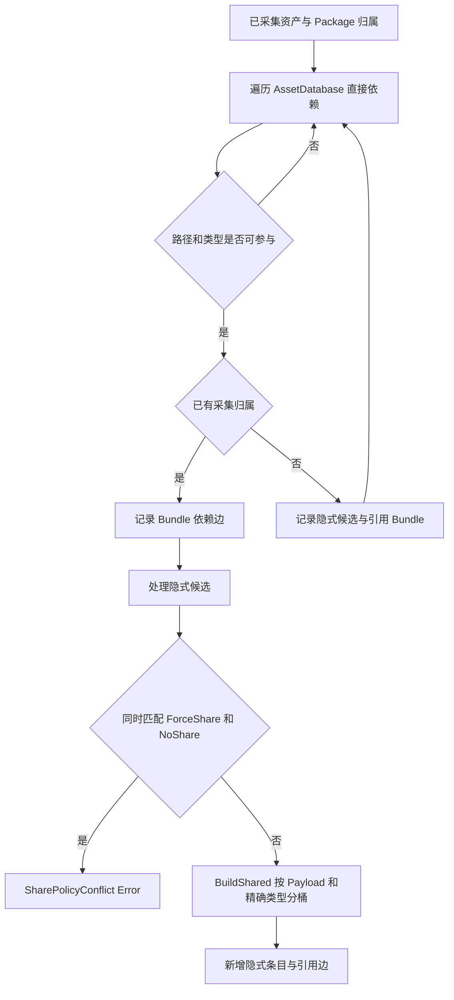

# 依赖分析与共享 Bundle

> **关联代码** | [DependencyAnalysis](../../Assets/FYAsset/Scripts/AB/Build/Collector/Editor/DependencyAnalysis/) · [SharePolicyConfig](../../Assets/FYAsset/Scripts/AB/Build/Collector/SharePolicyConfig.cs)

依赖分析在普通资产与内置资产采集之后、Bundle 构建之前执行。它发现隐式依赖、建立 Bundle 依赖边，并把新增条目写回构建上下文。它不负责运行时引用计数。

## 输入与输出

`TaskAnalyzeDependencies` 从 BuildContext 读取 `CollectedAssets` 和 `SharePolicies`，调用 `DependencyAnalyzer.Analyze`，再写回扩展后的资产列表及 `BundleDependencyGraph`。Error 消息使 Task 返回 Fatal；Warning 随结果返回。配置来源与具体回退以 Task 代码为准。

| 结构 | 职责 |
|---|---|
| CollectedAssetInfo | 已采集资产及新增隐式资产的构建视图 |
| DependencyAnalyzer | 按 Package 分析直接依赖、归属和隐式候选 |
| BundleDependencyGraph | FromBundle → ToBundle 依赖边及触发资产路径 |
| SharePolicyConfig | 共享规则配置；部分字段是保留配置，不等于当前决策分支 |

## 分析流程

过滤不仅看扩展名，也检查路径与不支持的 Bundle entry。被忽略的编辑器或代码文件不应被当成运行时资源；精确过滤集合以 `DefaultFilterExtensions`、`ShouldSkip` 及资产分类器为准。依赖重复展开与循环诊断属于构建分析，不替代运行时 BundleLoader 的路径循环检查。

## 当前共享规则

当前 `ApplySharePolicy` 的行为是：

1. 同时匹配 `ForceSharePatterns` 与 `NoSharePatterns` 时报告配置冲突并跳过该候选。
2. 其他隐式候选统一调用 `BundleNameBuilder.BuildShared`，按 Serialized Payload 和精确 PrimaryType 形成共享 Bundle。
3. 为每个引用 Bundle 添加指向共享 Bundle 的边。

**当前没有按 MinReferenceCount 或 MinAssetSizeBytes 决定共享的分支，也没有匹配 NoShare 后复制进引用 Bundle 的分支。** 配置字段存在不表示对应旧策略仍在执行；不要根据旧阈值图配置行为预期。

新增隐式条目使用 `$shared` Group、`ImplicitDependency` Role、`Implicit` CollectorType，Labels 为空；Address 使用短名样式。它们是分析结果，不反向创建 Collection 的人工 AssetEntry。

## 依赖图

`BundleDependencyGraph.Edges` 保存 `FromBundle`、`ToBundle`、`ViaAssets`。`AddEdge` 合并相同起终点，自引用边不添加。查询索引由图内部建立；调用方应使用提供的变更方法，不能把公开集合任意修改等同于自动维护索引。

图被后续 Bundle 构建和 Manifest 生成消费。最终运行时加载使用 Manifest 中的 Bundle 依赖索引，不读取 Editor 图对象。

## 验证边界

本说明来自当前源码，不证明 Unity 对所有资产类型都能构建成功。阈值字段、NoShare 名称与当前规则之间的差异是现存限制，不能为使文档与旧设计一致而擅自恢复旧算法。核心构建流程与文件角色见 [HTML 建模文档](./fyasset-modeling.html)。
