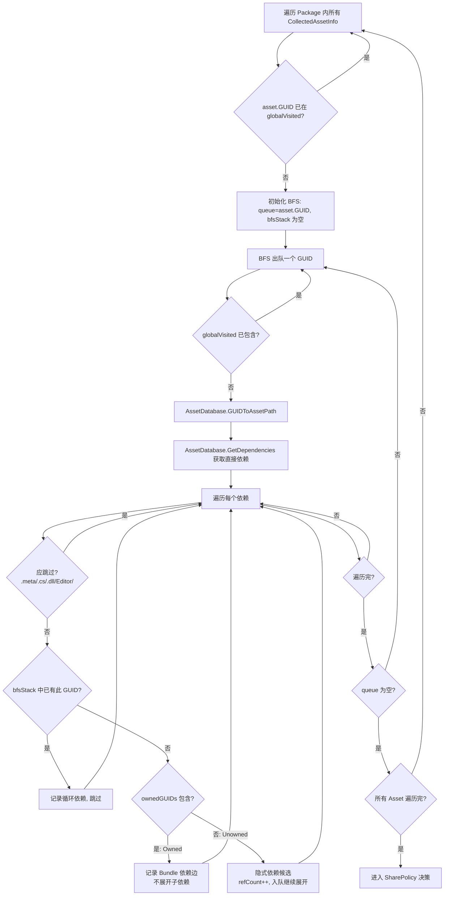
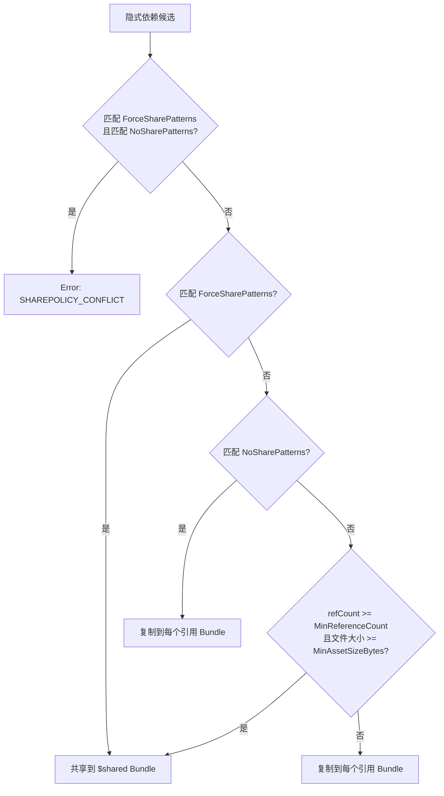

# 依赖分析与共享抽取

> 返回总览：[资源管理架构文档](./资源管理架构文档.md)

> **关联代码**
>
> `Assets/FYAsset/Scripts/AB/Build/Collector/Editor/DependencyAnalysis/` · `Assets/FYAsset/Scripts/AB/Build/Collector/SharePolicyConfig.cs`

---

## 概述

依赖分析系统在 Collector 采集资产之后、打包 Bundle 之前运行。它完成三项工作：

1. **构建 Bundle 依赖图** — 分析资产间的引用关系，推导 Bundle 级别的依赖边
2. **发现隐式依赖** — 找出被采集资产引用但不在 Collector 范围内的资产，自动补入
3. **共享提取决策** — 被多个 Bundle 引用的隐式依赖，按策略决定是提取到共享 Bundle 还是复制到各引用 Bundle

核心组件：

| 组件 | 职责 |
|------|------|
| `DependencyAnalyzer` | 单次 BFS 遍历，完成依赖边构建 + 隐式发现 + 共享决策 |
| `BundleDependencyGraph` | Bundle 依赖图，存储有向边列表，支持按需构建索引 |
| `TaskAnalyzeDependencies` | IBuildTask 实现，将依赖分析接入构建管线 |
| `SharePolicyConfig` | Per-Package 共享策略配置 |
| `AssetConflictRules` | 资源冲突处理规则 |

---

## BFS 依赖扫描

`DependencyAnalyzer.Analyze` 是唯一入口。对每个 Package 独立执行分析。

### 算法



### 关键机制

**全局 visited 集合**（`globalVisited`）：跨资产共享的 BFS 访问记录，防止同一个 GUID 被重复展开。

**BFS 路径栈**（`bfsStack`）：记录当前 BFS 路径上的 GUID 和路径。检测到 `depGuid` 已在 `bfsStack` 中 → 循环依赖，报告 `CYCLE_DEPENDENCY` 并跳过。最多报告前 20 个循环，超出部分给出 `CYCLE_TRUNCATED` 警告。

**Owned vs Unowned**：
- Owned — 依赖的 GUID 在 Collector 采集结果中 → 记录一条 Bundle 依赖边（From=触发资产 Bundle, To=被依赖资产 Bundle），不展开其子依赖
- Unowned — 依赖的 GUID 不在采集结果中 → 这是隐式依赖，标记为候选，`refCount++`，继续 BFS 展开其子依赖

**过滤规则**：跳过的文件类型 — `.meta`、`.cs`、`.dll`、`.asmdef`、`.asmref`、`.py`、`.js`、`.shader`；跳过的目录段 — `/Editor/`、`\Editor\`；跳过非 `Assets/` 路径。

---

## 共享提取决策

隐式依赖候选收集完毕后，进入 SharePolicy 决策。每个候选按以下优先级判断：



### SharePolicyConfig 配置

| 字段 | 默认值 | 说明 |
|------|--------|------|
| `MinReferenceCount` | 2 | 触发共享的最小引用 Bundle 数 |
| `MinAssetSizeBytes` | 0 | 小于此值的资产不参与共享 |
| `ForceSharePatterns` | 空 | Glob 匹配的资产强制共享 |
| `NoSharePatterns` | 空 | Glob 匹配的资产永不共享 |

`ForceSharePatterns` 和 `NoSharePatterns` 使用 Glob 模式匹配（`GlobMatcher.IsMatch`）。同一资产同时匹配两者 → `SHAREPOLICY_CONFLICT` 错误，配置错误不会静默降级。

### 隐式依赖条目的生成

共享型隐式依赖：
- `GroupName` = `$shared`（`SystemIdentifiers.SharedGroupName`）
- `CollectorType` = `Implicit`
- `EAssetRole` = `ImplicitDependency`
- `BundleName` = `{package}_shared_{primaryType}`
- `Address` = 隐式依赖条目没有 AssetCollectionSetting 上下文，固定使用短名样式生成；显式资产/Group 操作可在采集面板中使用 `Name#Type`
- `Labels` = 空

复制型隐式依赖：
- `GroupName` = 对应 Package 名
- `BundleName` = 引用方 Bundle 名（打入引用 Bundle）
- 其余同上

---

## BundleDependencyGraph

`DependencyAnalyzer` 的输出之一，存储所有 Bundle 间的有向依赖边。

```
BundleDependencyGraph
└─ Edges: List<BundleDependencyEdge>
     ├─ FromBundle   (引用方 Bundle 名)
     ├─ ToBundle     (被引用方 Bundle 名)
     └─ ViaAssets    (触发此边的资产路径列表)
```

`AddEdge(from, to, viaAsset)` 自动去重——相同 From+To 组合的边合并，ViaAssets 追加。自引用边（From == To）被忽略。

`GetDependencyMap()` 按需构建 `Dict<string, HashSet<string>>` 索引，O(1) 查询某个 Bundle 依赖哪些 Bundle。Edges 变更后懒缓存自动失效。

---

## TaskAnalyzeDependencies

实现 `IBuildTask`，将依赖分析接入构建管线。

```
TaskName:     "TaskAnalyzeDependencies"
DependsOn:    ["TaskCollectAssets"]
ReadKeys:     [CollectedAssets, SharePolicies]
WriteKeys:    [CollectedAssets, BundleDependencyGraph]
```

执行流程：
1. 从 `BuildContext` 读取 `CollectedAssets`（由前置 Task 写入）
2. 读取 `SharePolicies`；不存在时从 `AssetCollectionSetting` SO 回退加载
3. 调用 `DependencyAnalyzer.Analyze`
4. 将增强后的资产列表和 `BundleDependencyGraph` 写回 `BuildContext`
5. Error 级别消息 → `DEPENDENCY_ANALYSIS_FAILED`（Fatal），Warning 随 Ok 结果携带

---

## AssetConflictRules

处理资源冲突场景（同名资源、同 GUID 冲突等）。由 Collector 和依赖分析阶段共同消费。
