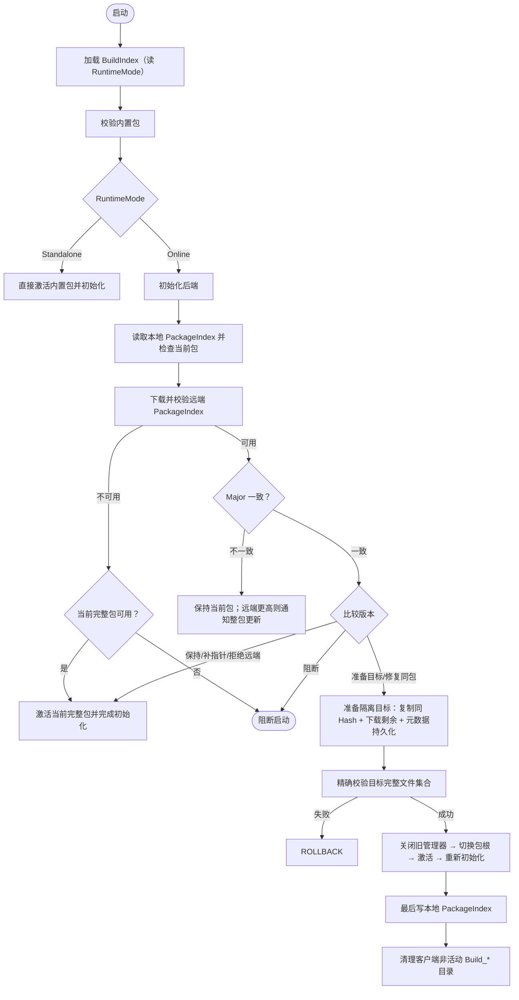

# 热更新系统

> 返回总览：[资源管理架构文档](./资源管理架构文档.md)

> **关联代码**
>
> `Assets/FYAsset/Scripts/Shared/Hotfix/`（`HotfixFlowBase`、`HotfixStateDecider`、`package-root state`、`HotfixRuntimeUpdate`、`HotfixContext`、`HotfixPackageInspection`、`HotfixPackageValidator`、`IHotfixPipeline`） · `Assets/FYAsset/Scripts/Shared/Runtime/RuntimePathManager.cs` · `BuildIndexData.cs` · `RuntimeMode.cs` · `Assets/FYAsset/Scripts/AA/Hotfix/` · `Assets/FYAsset/Scripts/AB/Hotfix/` · `Assets/FYAsset/Scripts/Compat/HotfixManager.cs`

---

## 定位

运行时热更是四段管线的第四段，与**构建期 Hotfix** 是两件不同的事：

| | 构建期 Hotfix | 运行时 Hotfix |
|---|---|---|
| 触发 | 构建入口的 `BuildType.Hotfix` | Player 启动或业务调用 `Check/Prepare/Apply` |
| 产物 | 独立包目录：AB 为完整目标 Manifest + 相对最近成功 Full 的变化内容；AA 为本次构建产出内容 + `AASourceScan.json` | 本地激活包根内的完整包 |
| 数据模型 | `ABManifest` / `AAManifest`、`FileDigest`、`FileDiff`、`CompleteBuildSummary`（含 `ContentReuseRecord` 复用事实） | `BuildIndexData`、`PackageIndex`、`package-root state` |

热更系统由 `HotfixFlowBase` 统一编排：Shared 只处理通用状态决策、文件摘要校验、隔离目录、下载和错误分类；后端特定的清单解析、下载项映射、元数据持久化与激活由 `IHotfixPipeline` 实现承担。

---

## 内容来源：只有四种状态

```csharp
public enum package-root state
{
    BuiltIn,       // StreamingAssets 内置完整包（Standalone 时为隔离子目录）
    Local,         // Persistent/Hotfix/Build_xxx 已激活完整包
    RemoteTarget,  // 正在隔离目录中准备、尚未激活的目标包
    Blocked        // 没有可继续使用的完整包
}
```

激活后**一次运行时上下文只读取一个包根**（`RuntimePathManager.ActivePackageRoot`）：禁止 Manifest 来自 Local、单个内容文件回退 BuiltIn 的混合读取。

`RuntimeMode` 是联网与否的唯一运行时事实来源：

```csharp
public enum RuntimeMode { Online, Standalone }
```

它由构建导出写入 `BuildIndexData.RuntimeMode`（`CompleteBuildSummary.ResolveRuntimeMode(BuildType)`：Standalone 为离线包，其余为联网包），启动时由 `RuntimePathManager.Initialize` 锁定；运行时只读该字段，不再回读任何构建期设置。

---

## 核心组件

| 组件 | 职责 |
|---|---|
| `AAHotfixManager` / `ABHotfixManager` | concrete 入口：提供后端、URL/重试设置、`GetActiveHandleCount`、`ShutdownPackageManager`、`FinishHotfix` |
| `HotfixManager`（Compat） | 兼容门面，按宿主传入的 `BackendMode` 路由旧调用方 |
| `HotfixFlowBase` | 12 步确定性状态机 + 运行中 Check/Prepare/Apply |
| `HotfixStateDecider` | 纯状态决策：不读文件、不联网、不改路径，失败矩阵每行都可脱离 Unity 断言 |
| `CurrentPackageRoot` / `HotfixRuntimeUpdate` | 当前激活包根与 Check/Prepare/Apply 阶段和结果类型 |
| `IHotfixPipeline` | 后端差异接口，共 6 个方法 |
| `HotfixContext` | 流程上下文：BuildIndex、当前/目标包、远端索引、准备状态 |
| `HotfixVersionInfo` / `BundleDownloadItem` / `HotfixStepResult` | 统一版本视图、下载项最小信息集、步骤结果 |
| `NetworkDownloader` | 文本/字节/文件下载原语；重试策略由 `HotfixFlowBase` 统一控制 |

`IHotfixPipeline` 只隔离 6 类后端差异：`InitializeBackendAsync`、`InspectPackageAsync`（精确检查指定包根，**不回退到其他目录**）、`FetchRemoteVersionAsync`、`GetBundleDownloadList`、`PersistRemoteMetadataAsync`、`ActivatePackageAsync`。

---

## 启动流程



步骤名固定（`_stepNames`，也是进度分母）：

```text
加载 BuildIndex → 校验内置包 → 初始化后端 → 检查本地包 → 下载 PackageIndex
→ 比较版本 → 获取远端版本 → 准备下载列表 → 下载 Bundle → 处理下载结果
→ 应用更新 → 完成初始化
```

---

## 失败矩阵

| 条件 | 决策 |
|---|---|
| BuildIndex 无效或 BuiltInPackage 不完整 | Error，阻断（`DecideBuiltInUsable`） |
| `RuntimeMode = Standalone` | 只用内置完整包，不联网、不读远端 PackageIndex |
| Online 且本地 PackageIndex 可信且非内置包身份 | 当前候选为 `Local`（`DecideCurrentPackageRoot/BuiltInPackageRoot`） |
| 本地指针/目录损坏或 Major 与内置包不一致 | Warning，使用 `BuiltIn` 继续远端检查 |
| 远端不可用（PackageIndex 下载/校验失败） | 使用当前完整包；退化到内置包时 `DegradedToBuiltIn = true`，调用方必须给出 Warning；RuntimeMode 不变 |
| 同版本同包且本地完整 | `KeepCurrent` |
| 同版本同包、本地完整但指针不可信 | `RepairPointer`：只补写本地 PackageIndex |
| 同版本同包且当前内容为内置包但损坏 | `Block`：内置包属于安装包内容，无法在持久化目录内修复 |
| 同版本同包且本地内容损坏 | `RepairPackage`：在隔离目录内准备并修复同一包 |
| 同 Major 且远端版本严格更高、包名不同 | `PrepareTarget` |
| 同版本换包、降级、或同名目录内的前向发布 | `RejectRemote`：Warning，拒绝自动切换 |
| 远端 Major 更高 | 保持当前完整包（没有完整包则阻断）并 `OnClientUpdateRequired` |
| 远端 Major 更低 | 按发布/Channel 异常处理，保持当前完整包 |
| 目标下载或校验失败 | 删除目标，保持当前完整包（`DecideTargetFailure`） |
| Apply 时仍有 AssetHandle / SceneHandle | Warning，拒绝 Apply，不强制释放（`DecideApply`） |
| 激活或资源管理器初始化失败 | 不写指针，恢复此前完整包；恢复失败则阻断（`DecideActivationRollback`） |
| 写本地 PackageIndex 的前置条件 | `ShouldPersistLocalPackageIndex(packageActivated, runtimeInitialized)` |

---

## 运行中 Check / Prepare / Apply

| 阶段 | API | 行为 |
|---|---|---|
| Check | `CheckAsync()` | 只读远端 PackageIndex 并做版本决策；不下载内容、不切换包根。返回 `HotfixCheckResult`（`Action`、目标包名/版本、`HasUpdate`、`ClientUpdateRequired`） |
| Prepare | `PrepareAsync()` | 当前包继续运行，只在目标隔离目录内复制同 Hash 内容、下载剩余内容并完整校验；失败时保留 staging 作为诊断物，当前包不受影响；成功后可重复调用（幂等返回 Ok） |
| Apply | `ApplyAsync()` | 业务回到安全入口并释放全部 Handle 后：门禁检查 → 关闭旧 Manager → 切换包根 → 激活 → 重新初始化 → 最后写本地 PackageIndex → 清理非活动包 |

框架**不负责**弹窗、UI、场景跳转、停止业务协程或强制释放 Handle：`Apply` 被门禁拒绝时只返回结构化错误，由业务自行释放后重试。

`CheckAsync` 在以下情况返回不可准备结果：启动流程未完成、Standalone、后端不可用、AB 当前 Target 缺失/非法、AA HotfixUrl 不可用、远端 PackageIndex 不可用。

---

## 下载、校验与复用

| 规则 | 实现 |
|---|---|
| 重试 | AA 的 `HotfixUrl` 来自 `FYAssetAASettings`；AB 的地址由 `FYAssetSettings.CurrentABTargetId` 解析到 Target 的 `PublicBaseUrl` 后拼接 `/AB/`；最大重试次数与基础退避时间来自对应后端设置 |
| 原子落地 | 网络下载先写 `{bundleName}.tmp`，只有下载完成且 CRC 校验通过才替换目标文件；本地复用同样先复制到 `.tmp` 再校验 |
| 残留清理 | 下载前清理目标 bundles 目录中的 stale `.tmp` |
| 元数据校验 | `FileCRC == 0` 视为 Manifest 损坏；大小与 CRC 必须同时通过（`HotfixPackageValidator`） |
| 复用来源 | 只把**当前完整包**作为跨包复用来源：按 Hash → BundleName 建立索引，命中的文件复制到 `.tmp` 校验后替换；不扫描其他历史目录 |
| 并发 | Bundle 下载并发受信号量限制，逐个回报进度 |

复用是否生效取决于相同 Hash 的候选和实际大小/CRC 校验结果，不保证任意更新的节省比例。

---

## 本地数据与旧包清理

- `BuildIndex.json` 位于 StreamingAssets，是启动标记与安装包身份，不受“单一包根”约束。
- 本地 `PackageIndex` 只在包已激活**且**资源管理器初始化成功之后写入；写入失败路径绝不留下指向未激活包的指针。
- 前向更新、同包修复与整包指针补写完成后，删除 `HotfixRoot` 下除当前激活包外的全部直接子级 `Build_*`；只处理 `HotfixRoot` 的直接子级且目录名符合包名规则，不安全目录跳过并记录 Warning。
- 普通同包启动、远端失败回退和 Major 不匹配回退不触发旧包清理（传入的活动包根为空表示当前使用内置包）。
- 不保留数量配置，不按修改时间排序；删除失败只记录警告，不影响当前包启动。

---

## URL 与本地路径规范

- 远端路径统一通过 `FYAssetPathUtility.JoinUrl(...)` 生成。AA 使用 `FYAssetAASettings.HotfixUrl`；AB 使用当前 Publish Target 的 `PublicBaseUrl + /AB/`。两者都得到稳定的单斜杠 URL。
- Publish Target 使用服务总根，并把 AA/AB 分别放在 `/AA/` 与 `/AB/`。AB 不再把 URL 复制到 `FYAssetABSettings`，也没有 `Apply URL` 写回动作。
- 本地热更目录、目标包体目录、bundle 保存路径、manifest 写入路径和本地 `PackageIndex.json` 使用本地文件系统路径规则拼接。
- Unity `StreamingAssets` 读取路径通过共享路径工具拼接，但 Android `jar:` URI-like 路径保持 `/` 分隔符，不会被规范化成 Windows 本地路径。
- `bundles`、`catalog.json`、`BuildIndex.json` 等跨模块目录/文件名来自 `FYAssetSettings` 常量，不在热更主链路中重复写字符串字面量。

---

## 双后端差异

| | AB 后端 | AA 后端 |
|---|---|---|
| 元数据文件 | 1 个（`ABManifest.bin/.json`） | 2 个（`AAManifest` + `catalog.json`） |
| 初始化 | 无操作（直接返回 Ok） | `Addressables.InitializeAsync` |
| 版本信息源 | `ABManifest.ContentEntries` | `AAManifest.Bundles` |
| 元数据持久化 | 原子写 `ABManifest` | 原子写 `AAManifest`，缺失时下载并替换 catalog |
| 激活 | 空操作；最终由 `ABPackageManager` 初始化读取 | 加载并激活目标包的外部 catalog |
| 格式优先级 | `.bin` → `.json` | `.bin` → `.json` |
| Addressables 依赖 | 无 | 需要 |

---

## 数据与验证边界

`BuildIndexData` 位于 Shared/Runtime，由构建写出、热更启动读取。`VersionNumber` 为 struct，旧 Binary 格式不兼容；default 版本不证明 JSON 字段原本存在。配置中的重试次数/延迟直接传给流程与下载器，没有独立 `HotfixDownloadOptions` 对象。

本文描述源码分支。历史线上验证不作为当前状态证明；真实 Player、Android StreamingAssets 与远端部署需要单独验收。完整流程图见 [HTML 建模文档](./fyasset-modeling.html)。
