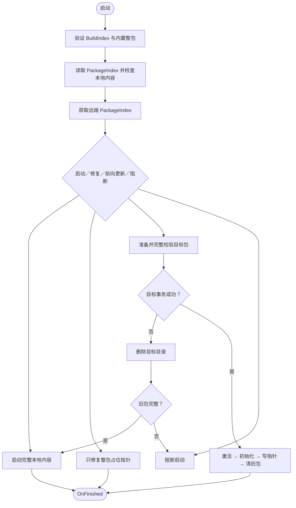

# 热更新系统

> 返回总览：[资源管理架构文档](./资源管理架构文档.md)

> **关联代码**
>
> `Assets/FYAsset/Scripts/AA/Hotfix/AAHotfixManager.cs` · `Assets/FYAsset/Scripts/AB/Hotfix/ABHotfixManager.cs` · `Assets/FYAsset/Scripts/Shared/Hotfix/HotfixFlowBase.cs` · `Assets/FYAsset/Scripts/Compat/HotfixManager.cs` · `Assets/FYAsset/Scripts/Shared/Hotfix/IHotfixPipeline.cs` · `Assets/FYAsset/Scripts/AA/Hotfix/Backends/` · `Assets/FYAsset/Scripts/AB/Hotfix/Backends/`

***

## 概述

热更新系统负责在 App 启动后检查远端资源更新、下载新 Bundle、切换到最新版本。当前有 `AAHotfixManager` 与 `ABHotfixManager` 两个 concrete 入口，共用 `HotfixFlowBase` 的 11 步流程；旧 `HotfixManager` 作为兼容门面保留给现有启动调用方。

设计目标：

- 热更流程本身**与后端解耦** — 编排逻辑写在 `HotfixFlowBase` 里，AA/AB concrete flow 只提供后端、URL/重试设置和最终 runtime manager 初始化
- AA 路径仍依赖 Addressables catalog 进行资源定位；自定义 AAManifest 用于版本、Bundle 校验和查询索引。AB 路径用自研 ABManifest 替代 Addressables catalog。
- 单机离线包通过 `FYAssetSettings.StandaloneBuild` 短路联网步骤：`HotfixFlowBase.IsStandaloneMode()` 返回 true 时，加载 BuildIndex 后直接完成 PackageManager 初始化与绑定，不创建热更后端、不下载、不比对版本。

***

## 核心组件

| 组件                   | 职责                                                               |
| -------------------- | ---------------------------------------------------------------- |
| `AAHotfixManager`    | AA concrete 热更入口，使用 AA 设置、`AAHotfixBackend` 和 `AAPackageManager` |
| `ABHotfixManager`    | AB concrete 热更入口，使用 AB 设置、`ABHotfixBackend` 和 `ABPackageManager` |
| `HotfixManager`      | 兼容门面，根据宿主传入的 `BackendMode` 路由旧调用方                                    |
| `HotfixFlowBase`     | 11 步确定性状态机，负责包指针决策、进度/错误回调与 BuildIndex 初始化；`IsStandaloneMode()` 短路离线包 |
| `HotfixStateDecider` | 纯状态决策：本地激活、基线回退、同包修复、目标更新或终止启动                                   |
| `IHotfixPipeline`    | 后端抽象接口，定义 7 个后端差异方法                                              |
| `ABHotfixBackend`    | AB 后端实现 — 基于 ABManifest，无需 Addressables 依赖                       |
| `AAHotfixBackend`    | AA 后端实现 — 基于 Addressables + catalog，同时使用 AAManifest 作为版本和查询索引数据  |
| `HotfixContext`      | 热更流程上下文，携带 BuildIndex / 目标包名 / URL 等                             |
| `HotfixVersionInfo`  | 统一版本视图，屏蔽 AA/AB 的数据模型差异                                          |
| `BundleDownloadItem` | 下载项最小信息集（BundleName / FileHash / FileCRC / FileSize）             |
| `HotfixStepResult`   | 结构化步骤结果，替代裸 bool 返回值                                             |
| `NetworkDownloader`  | 网络下载器，提供文本/字节/文件下载原语；Bundle 重试策略由 `HotfixFlowBase` 统一控制          |

***

## IHotfixPipeline — 后端抽象接口

接口只隔离 7 类后端差异：初始化、检查隔离包、读取远端版本、生成 Bundle 列表、判断元数据完整性、持久化元数据和激活包。编排、重试、校验与状态决策全部留在 `HotfixFlowBase`，避免 AA/AB 各自复制流程。

`InspectPackageAsync` 必须检查指定隔离包，不得回退到 `StreamingAssets`；元数据持久化与包激活分开，避免未验证内容提前生效。具体后端由 `AAHotfixManager` / `ABHotfixManager` 决定；旧 `HotfixManager` 只消费启动宿主传入的 `BackendMode`，不读取 `FYAssetSettings`。

***

## HotfixVersionInfo — 统一版本视图

AA 和 AB 后端各自读取 AAManifest / ABManifest，但统一输出 manifest hash、版本、Bundle 数量、总大小和下载列表。状态机只依赖这份统一视图，不理解后端清单结构。

当前 AB 运行时用完整 `BundleEntries` 生成待准备列表，并通过目标目录命中和旧包同 Hash 复用避免重复下载。`DeliveryBundles` 仍是构建/发布阶段相对 Full baseline 的物理交付列表，不是当前运行时状态机的唯一下载输入

***

## 热更流程

| 条件 | 结果 |
|---|---|
| 内置整包无效 | 立即阻断 |
| 本地 PackageIndex 缺失、损坏或 Major 不同 | 必须联网修复，远端不可用则阻断 |
| 远端不可用 | 本地完整则启动，否则阻断 |
| 远端 Major 更高 | 本地完整则提示整包更新并启动，否则阻断 |
| 远端 Major 更低 | 作为发布异常，本地完整则告警启动，否则阻断 |
| 包名和版本一致 | 完整则直接启动；整包占位只补指针；热更包不完整则修复 |
| 同 Major 且远端版本严格更高、包名不同 | 前向更新 |
| 远端版本更低、同版本换包或同目录换版本 | 作为发布异常，不更新 |

目标包只有在完整校验、激活和 `FinishHotfix()` 全部成功后才写入本地 `PackageIndex`，随后清理旧包。任一目标准备步骤失败都会删除目标目录；旧包完整才允许回退。

### 进度回调

`HotfixManager` 兼容门面和 AA/AB concrete manager 都提供事件供 UI 层监听：

- `OnStepChanged(string stepName)` — 步骤切换时触发
- `OnProgress(float progress, string stepName)` — 进度更新（0\~1 全局进度 + 当前步骤名）

总步骤表由 `_stepNames` 数组驱动，计算公式：`overallProgress = (stepIndex + stepProgress) / _stepNames.Length`。

### 错误处理

- `OnWarning(string message)` — 可恢复问题，例如远端不可用或发布目标异常
- `OnError(string message)` — 致命问题；随后抛出 `HotfixFatalException` 终止启动
- `OnClientUpdateRequired(ClientUpdateRequiredInfo)` — 远端 Major 更高时通知上层
- 远端失败规则固定为“本地完整则启动，否则阻断”，不提供运行时策略开关
- 目标准备失败会删除目标目录，不会写入本地 `PackageIndex`

### Bundle 下载安全策略

Bundle 下载阶段由 `HotfixFlowBase` 统一管理重试与校验：

- `HotfixUrl`、最大重试次数和基础退避时间来自当前后端设置：AA 读取 `FYAssetAASettings`，AB 读取 `FYAssetABSettings`。
- 默认最大重试次数为 3，基础退避时间为 1 秒，即失败后按 1s / 2s / 4s 等待重试。
- 网络下载先写入 `{bundleName}.tmp`，只有下载完成且 CRC 校验通过后才替换目标 Bundle。
- 本地同 Hash 复用也先复制到 `.tmp`，CRC 通过后再替换目标文件。
- 启动下载前会清理目标 bundles 目录中的 stale `.tmp` 文件。
- `FileCRC == 0` 视为 Manifest 损坏；所有 Bundle 必须同时通过大小与 CRC 校验。

***

## URL 与本地路径规范

- 远端路径统一通过 `FYAssetPathUtility.JoinUrl(...)` 生成，包括 `PackageIndex.json`、包体根、manifest、`catalog.json` 和 bundle 下载 URL；当前后端设置中的 `HotfixUrl` 带不带尾斜杠都应得到相同的单斜杠 URL。
- 发布 Target 使用服务总根，并将 AA/AB 分别放在 `/AA/` 与 `/AB/`。因此 AA `HotfixUrl` 必须指向含 `AA/PackageIndex.json` 的 `/AA/` 根，AB 同理指向 `/AB/`，不能让两个后端共享一个根部 PackageIndex。
- Repository 的 `Apply URL` 根据 Target `PublicBaseUrl` 显式写入当前后端设置；Push 不会自动切换客户端 URL。
- 当前 AA 生产根为 `https://firehappy-cfy.com/AA/`，已通过清缓存的 `TestDialogue` 验证远端 PackageIndex、AAManifest、catalog、7 个 Bundle、外部 catalog 激活和 Lua 对话资源加载。
- AB 在重新执行 Full、建立 Full 基线并发布 `/AB/PackageIndex.json` 之前仍不可用于远端热更验收；AA 的已发布内容不会作为 AB fallback。
- 本地热更目录、目标包体目录、bundle 保存路径、manifest 写入路径和本地 `PackageIndex.json` 使用本地文件系统路径规则拼接。
- Unity `StreamingAssets` 读取路径通过共享路径工具拼接，但 Android `jar:` URI-like 路径保持 `/` 分隔符，不会被规范化成 Windows 本地路径。
- `bundles`、`catalog.json`、`BuildIndex.json` 等跨模块目录/文件名来自 `FYAssetSettings` 常量，不在热更主链路中重复写字符串字面量。

***

## 双后端差异

|                | AB 后端                          | AA 后端                           |
| ------------------- | ------------------------------ | ------------------------------- |
| **元数据文件**           | 1 个（ABManifest.bin/.json）      | 2 个（AAManifest + catalog.json）  |
| **初始化**             | 无操作（直接返回 Ok）                   | Addressables.InitializeAsync    |
| **版本信息源**           | ABManifest.BundleEntries       | AAManifest.Bundles              |
| **元数据持久化**          | 原子写 ABManifest                 | 原子写 AAManifest，缺失时下载并替换 catalog |
| **激活**              | 空操作；最终由 ABPackageManager 初始化读取 | 加载并激活目标包的外部 catalog             |
| **格式优先级**           | .bin → .json                   | .bin → .json                    |
| **Addressables 依赖** | 无                              | 需要                              |

***

## 包体清理

- 本地 `PackageIndex` Major 与 `BuildIndex` 不同时按损坏指针处理，不在启动阶段删除目录。
- 前向更新或同包修复完成，并且 PackageManager 初始化成功后，删除 HotfixRoot 下除目标 Hotfix 包外的全部直接子级 `Build_*`。
- 整包占位指针修复成功后删除全部历史 `Build_*` 目录。
- 普通同包启动、远端失败回退和 Major 不匹配回退不触发旧包清理。
- 不保留数量配置，不按修改时间排序；删除失败只记录警告。

***

## 智能 Bundle 复用

下载阶段只把上一个成功激活包作为跨包复用来源，不扫描其他历史目录：

1. 目标目录已有文件通过大小/CRC 校验时直接保留。
2. 否则从上一个本地 Hotfix 包的 manifest 建立 `Hash → BundleName` 索引并尝试复制。
3. 复制到 `.tmp`，校验通过后替换目标文件；失败则回退网络下载。
4. 目标 Hotfix 包完成激活和初始化后，上一个本地 Hotfix 包与其他历史 Hotfix 包一起删除。

这个优化在"少量资源变更"的热更场景下效果显著——大部分 Bundle 根本没变。
