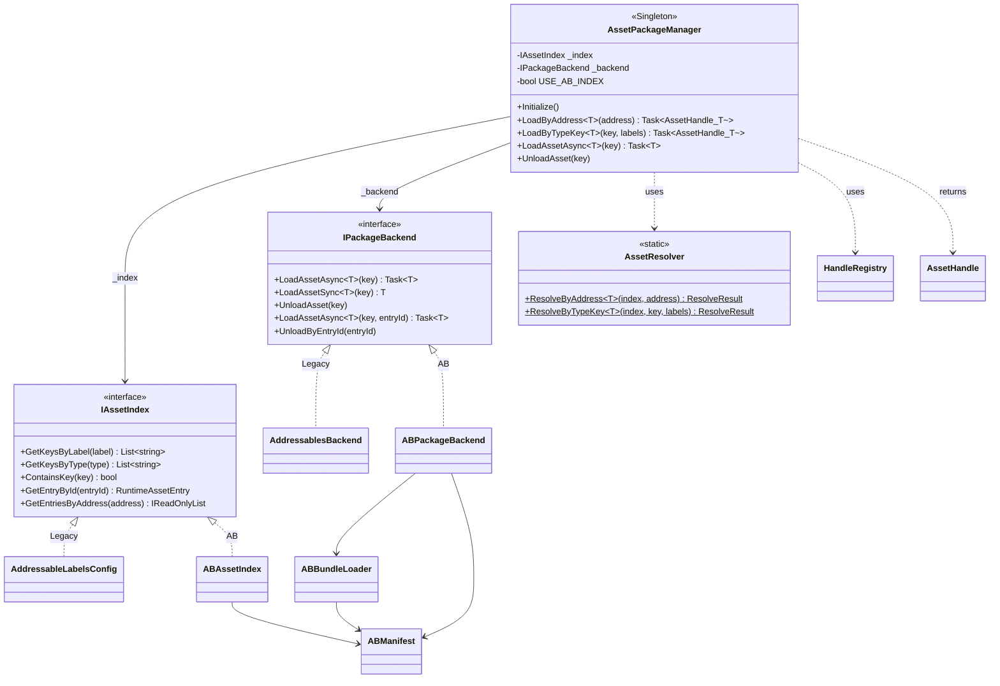
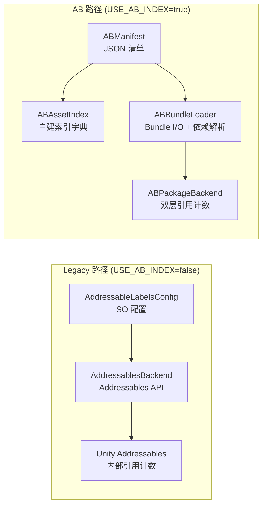
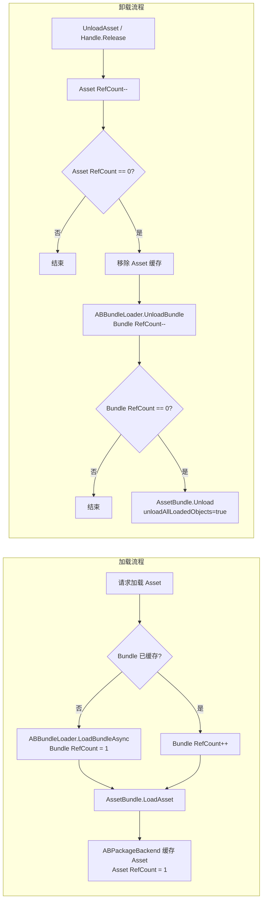
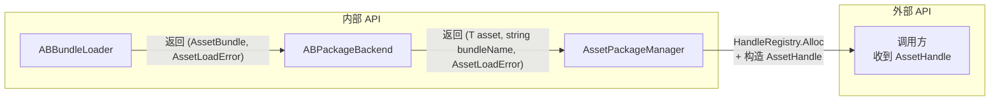
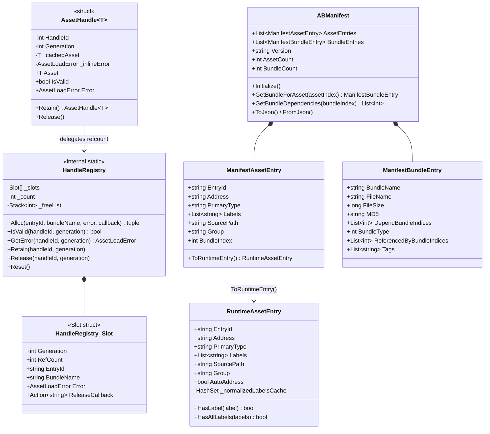
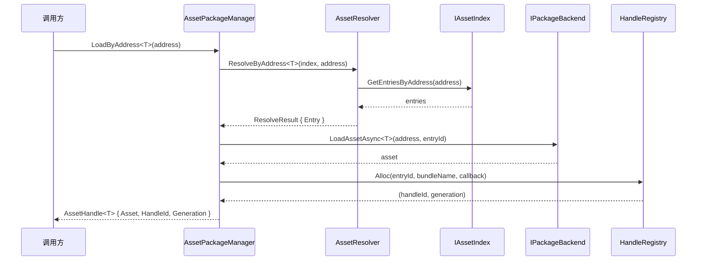

# 资源管理运行时架构

> Phase 1-3 已完成 | 2026-04-08

## 架构总览

## Legacy vs AB 对比

| 维度       | Legacy (Addressables)                  | AB (自研)                                 |
| -------- | -------------------------------------- | --------------------------------------- |
| **索引源**  | AddressableLabelsConfig SO             | ABManifest JSON                         |
| **加载后端** | AddressablesBackend → Addressables API | ABPackageBackend → AssetBundle API      |
| **依赖解析** | Addressables 内部自动                      | ABBundleLoader 递归解析 Bundle 级依赖          |
| **引用计数** | 单层（AsyncOperationHandle）               | 双层（Bundle 级 + Asset 级）                  |
| **资源标识** | Address 唯一                             | Address 可重复，EntryId 唯一                  |
| **错误处理** | 异常 + null                              | AssetLoadError 结构化错误码                   |
| **句柄模型** | 直接返回 T                                 | AssetHandle\<T> struct + HandleRegistry |

## 双层引用计数

AB 路径采用 Bundle + Asset 双层引用计数，精确控制卸载粒度：

**关键规则**：

- Bundle 引用计数 = 该 Bundle 下所有已加载 Asset 的引用数之和
- Asset RefCount 归零 → 移除 Asset 缓存 → 递减 Bundle RefCount
- Bundle RefCount 归零 → `AssetBundle.Unload(true)` 连同内部 Asset 一起卸载
- 依赖 Bundle 的 RefCount 由 ABBundleLoader 在递归加载时同步递增

## 错误处理约定

内外 API 采用不同的返回类型约定：

| 层级                                     | 返回类型                                                | 理由                               |
| -------------------------------------- | --------------------------------------------------- | -------------------------------- |
| ABBundleLoader → ABPackageBackend      | `(AssetBundle, AssetLoadError)` ValueTuple          | 内部无需句柄，直接传递错误                    |
| ABPackageBackend → AssetPackageManager | `(T, string bundleName, AssetLoadError)` ValueTuple | 需要 bundleName 注册到 HandleRegistry |
| AssetPackageManager → 调用方              | `AssetHandle<T>` struct                             | 统一外部接口，值语义零 GC                   |
| AssetPackageManager → 调用方 (Legacy)     | `AssetHandle<T>` struct                             | Legacy 路径也走 HandleRegistry，保持一致  |

**AssetLoadError 错误码**：

| Code                  | 含义                       |
| --------------------- | ------------------------ |
| NotFound              | 条目不存在                    |
| AmbiguousMatch        | Address 重复且无法消歧          |
| BundleNotFound        | Bundle 文件缺失              |
| BundleLoadFailed      | Bundle 加载失败（I/O、CRC 等）   |
| DependencyFailed      | 依赖 Bundle 加载失败           |
| AssetExtractionFailed | AssetBundle.LoadAsset 失败 |
| LoadFailed            | 通用加载失败                   |

## 核心数据结构

## 数据流

## 关键设计决策

| # | 决策                             | 理由                                      |
| - | ------------------------------ | --------------------------------------- |
| 1 | Address 允许重复，EntryId 唯一        | 同名资源多版本共存，GUID 保证内部一致性                  |
| 2 | Group 仅构建时使用，不参与运行时查询          | 运行时按 Address/Type/Labels 查询，Group 是打包概念 |
| 3 | 双层引用计数（Bundle + Asset）         | Bundle 级控制卸载粒度，Asset 级精确追踪使用            |
| 4 | AssetHandle\<T> 为 struct       | 值语义零 GC，Generation 防悬空                  |
| 5 | USE\_AB\_INDEX 一个开关控制两个维度      | 不存在"AB 索引 + Addressables 后端"组合          |
| 6 | Bundle 级依赖（无 Asset 级依赖）        | 数据模型简单，运行时递归解析开销可接受                     |
| 7 | AssetBundle.Unload(true) 引用归零时 | 连同 Asset 一起卸载，避免残留                      |
| 8 | 内部 ValueTuple / 外部 AssetHandle | 内部高效传递，外部统一安全接口                         |

